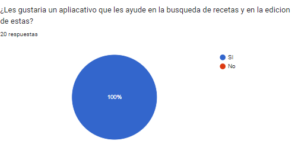

**Universidad Peruana de Ciencias Aplicadas**

Carrera de Ingeniería de Software

Ciclo V

Desarrollo de Aplicaciones Open Source 

WS52

Elio Jefferrson Navarrete Vilca

**TP**

FASTFOOD

|Alumnos||
| :-: | :- |
|Código|Apellidos y Nombres|
|u202120841|Achamizo Huamani, Jean Carlos|
|u20181c241|Castro Soto, Sebastian Enrique|
|u201719831|Oliveira Paucar, Mauricio|
|u202022018|Torres Alva, Alejandro|
|u20201c429|Zagal Vallejo, Nicolás|

SEPTIEMBRE 2023

**Registro de Versiones**

|**Versión**|**Fecha**|**Autor**|**Descripción de modificación**|
| :- | :- | :- | :- |
|TB1|Domingo 10 de setiembre|
- **Achamizo Huamani, Jean**

- **Torres Alva, Alejandro**

- **Castro Soto, Sebastian Enrique**

- **Oliveira Paucar, Mauricio**

- **Zagal Vallejo, Nicolás**

|
Se han incluido los capítulos:

● Capítulo I: Introducción

● Capítulo II: Requirements

Elicitation & Analysis,

● Capítulo III: Requirements

Specification

● Capítulo IV: Product Design

● Capítulo V: Product

Implementation, Validation &

Deployment

● Avance de Conclusiones,

Bibliografía y Anexos
|
|TP1|Viernes 29 de setiembre|
- **Achamizo Huamani, Jean**

- **Torres Alva, Alejandro**

- **Castro Soto, Sebastian Enrique**

- **Oliveira Paucar, Mauricio**

- **Zagal Vallejo, Nicolás**
|
● Capítulo V: Product

Implementation, Validation &

Deployment

● Avance de Conclusiones,

Bibliografía y Anexos
|
|TB2|Sabado 04 de Noviembre|
- **Achamizo Huamani, Jean**

- **Torres Alva, Alejandro**

- **Castro Soto, Sebastian Enrique**

- **Oliveira Paucar, Mauricio**

- **Zagal Vallejo, Nicolás**
|
● Capítulo V: Product

Implementation, Validation &

Deployment

● Avance de Conclusiones,

Bibliografía y Anexos
|
|TF||||

**Student Outcome**

|**Criterio específico**|**Acciones Realizadas**|**Conclusiones**|
| :- | :- | :- |
|Comunica oralmente sus ideas y/o resultados con objetividad a público de diferentes especialidades y niveles jerárquicos, en el marco del desarrollo de un proyecto en ingeniería.|
**Achamizo Huamani, Jean**

**TB1:**

Junto con el equipo realizamos diferentes reuniones presenciales para  organizar de manera eficiente la solución propuesta.

**Oliveira Paucar, Mauricio**

**TB1:** 

El equipo se reunió y se repartió responsabilidades, después de llegar a un acuerdo en la idea del proyecto.

**TP1:**

Se corrigieron y trabajaron diferentes aspectos que se mencionaron en el feedback con el profesor. Se llegaron a realizar todas las tareas.

**Torres Alva, Alejandro**

**TB1:** 

Nos reunimos con el grupo para organizar nuestras ideas y así poder desarrollar un proyecto con más eficiencia.

**TP1:**

Trabajamos de manera continua para llegar a un resultado esperado, así logrando tener un repositorio que contenga el apartado del frontend para nuestro aplicativo.

**Castro Soto, Sebastian Enrique**

**TB1:**

Nuestro grupo de trabajo desarrollo una idea para hacer el trabajo de manera que sea rentable sin excluir a ninguna persona

**TP1:**

Se corrigieron y trabajaron diferentes aspectos que se mencionaron en el feedback con el profesor. Y cuando se llegaron a realizar todas las tareas del despliegue fue algo que nos complicó.

**Zagal Vallejo, Nicolás**

**TB1:** 

El grupo se reunió en múltiples ocasiones en función de pulir cada aspecto del proyecto en función de desarrollarlo con la mayor eficiencia posible

**TP:** Trabajamos de manera continua en el proyecto, haciendo énfasis en la comunicación efectiva entre cada integrante. De esta manera conseguimos llevar a cabo el proyecto de manera óptima.
|
**TB1:**

Se establecieron bases sólidas en términos de requisitos, diseño, desarrollo y pruebas, lo que ha fortalecido nuestra confianza en el futuro del producto. 

**TP1:**

**TB2:**

**TF:**
|
|Comunica en forma escrita ideas y/o resultados con objetividad a público de diferentes especialidades y niveles jerárquicos, en el marco del desarrollo de un proyecto en ingeniería..|
**Achamizo Huamani, Jean**

**TB1:**

Nos hemos centrado en una comunicación efectiva con una audiencia diversa, incluyendo usuarios finales y expertos culinarios.

**Torres Alva, Alejandro**

**TB1:**

Nos centramos en dos públicos objetivos que serían los usuarios y los cocineros, por lo que al tratar con ellos de manera oral para así poder tener ideas más claras para nuestro proyecto.

**TP1:**

En este entregable  nos centramos en realizar el frontend para así tener un apartado para nuestros usuarios y del mismo frontend donde estaría el footer, header.

**Castro Soto, Sebastian Enrique**

**TB1:**

Según nuestro segmento objetivo e ideas iniciales logramos plazmar en todo el trabajo la idea del aplicativo que conectara cocineros con recetas

**TP1:**

Se corrigieron y trabajaron diferentes aspectos que se mencionaron en el feedback con el profesor. Y se llegaron a realizar todas las tareas el despliegue fue algo que nos complicó

**Oliveira Paucar, Mauricio**

**TB1:** 

El equipo llegó a la conclusión de tener dos segmentos objetivos (usuarios y chefs). Logrando así un mejor resultado para el proyecto.

**TP1:**

El equipo se enfocó en corregir e implementar el frontend en base a lo aprendido en las últimas semanas de clases.

**Zagal Vallejo, Nicolás**

**TB1:** 

Hemos decidido destacar dos segmentos objetivos para poder conseguir un resultado óptimo en el proyecto destacando las necesidades de cada uno

**TP:** Desarrollamos el proyecto de una manera organizada teniendo en cuenta los segmentos objetivos previamente establecidos, esto permitió un desarrollo óptimo del proyecto

|
***TB1:***

Nuestro equipo ha demostrado su habilidad para adaptar su comunicación a diferentes especialidades y niveles jerárquicos. Esto es esencial para asegurarse de que el proyecto sea comprensible y útil para todos los involucrados, desde los usuarios finales hasta los chefs que utilizarán la aplicación.

***TP1:***

***TB2:***

***TF:***
|

1\.1.1. Descripción de la Startup 

"FastFood" es una innovadora plataforma en línea diseñada para apasionados de la cocina y amantes de la gastronomía. Nuestra startup se dedica a proporcionar una experiencia culinaria completa, permitiendo a los usuarios:

- **Agregar Recetas Creativas**: Los usuarios pueden registrarse de forma gratuita y compartir sus propias recetas favoritas. Pueden cargar imágenes de sus creaciones culinarias, proporcionar instrucciones detalladas y marcar los ingredientes necesarios. Esto crea una amplia y diversa biblioteca de recetas que van desde las más simples hasta las más sofisticadas.

- **Comentar y Compartir**: Fomentamos la interacción y la comunidad al permitir que los usuarios comenten las recetas, compartan sus opiniones, hagan preguntas y proporcionen consejos. Esta función de comentarios facilita la colaboración y el aprendizaje entre los amantes de la cocina.

- **Acceso a Canales Premium de Chefs Reconocidos**: "FastFood" ofrece la posibilidad de suscribirse a canales premium de chefs reconocidos a nivel nacional e internacional. Estos chefs comparten sus recetas exclusivas, técnicas de cocina y secretos culinarios a través de videos detallados y tutoriales interactivos. Los suscriptores premium pueden disfrutar de contenido exclusivo y actualizaciones regulares.

- **Planes de Suscripción Flexibles**: Ofrecemos planes de suscripción flexibles que incluyen una opción gratuita con acceso básico a contenido, así como un plan premium de pago mensual o anual que desbloquea canales premium y beneficios adicionales. Los usuarios pueden elegir el plan que mejor se adapte a sus necesidades y presupuesto.

- **Contenido Personalizado:** Con el tiempo, nuestra plataforma utiliza algoritmos de recomendación para ofrecer contenido personalizado a los usuarios, sugiriendo recetas y chefs basados en sus preferencias culinarias y hábitos de navegación.

1\.1.2. Perfiles de integrantes del equipo

|Integrantes|Descripción|
| :-: | - |
|
**Nombre**: Jean Carlos Achamizo Huamani

**código**: u202120841

**Carrera**: Ingeniería de Software

|
Como estudiante de Ingeniería de Software en la Universidad UPC, mi entusiasmo por el aprendizaje constante me impulsa a buscar siempre nuevas maneras de perfeccionar mis habilidades académicas y aplicarlas en situaciones prácticas, también poseo aptitudes en comunicación asertiva y escucha activa. Reconozco la importancia de una comunicación clara y efectiva en cualquier proyecto de software, y cuento con la capacidad de escuchar de manera atenta para comprender las necesidades y expectativas de los clientes y colegas de equipo. Mi compromiso es emplear estas habilidades con el propósito de alcanzar los resultados más óptimos en cada proyecto en el que participe.

|
|
**Nombre**: Alejandro Torres Alva

**código**: u202022018

**Carrera**: Ingeniería de Software

|Como estudiante de la carrera de Ingeniería de Software en la Universidad Peruana de Ciencias Aplicadas. Dentro de mis habilidades considero que tengo conocimientos básicos en programación en c + + y python. También, considero que puedo apoyar a mi grupo en lo que se me encomienda y si tengo alguna duda llegaría a hablarlo con mi grupo.|
|
**Nombre**: Mauricio Oliveira Paucar

**código**: u201719831

**Carrera**: Ingeniería de Software

|
Me gusta mucho aprender cosas nuevas sobre mi carrera, trabajar en equipo de manera proactiva y lograr los objetivos junto a mis compañeros. Me considero una persona ambiciosa, ya que mi meta es llegar a obtener un alto cargo en una empresa que me agrade o formar mi propia empresa relacionada al software. Gracias a ello siempre podré trabajar en algo que me guste y llevar una vida cómoda. Cuento con conocimientos de C++ y HTML.

|
|
**Nombre**: Sebastian Enrique Castro Soto

**código**: u20181c241

**Carrera**: Ingeniería de Software

|Mi nombre es Sebastián Enrique Castro Soto, actualmente estudiante de la UPC en la carrera de ingeniería de software, tengo experiencia trabajando como diseñador de publicidad, diseño de mueblería en melamina y conocimiento en C++, C#, HTML y CSS. También, cuento con diversas habilidades de computación, como el manejo de cualquier tipo de programas Microsoft y diseño de programas con el lenguaje de programación |
|
**Nombre:** Nicolás Zagal Vallejo

**Código**: U20201C429

**Carrera:** Ingeniería de Software

|Soy estudiante de la carrera de Ingeniería de Software. Tengo conocimientos en lenguajes como C++, Python, HTML, CSS y de análisis de Base de Datos como SQL y NoSQL. Soy deportista de alto rendimiento y selección nacional de esgrima. En mis tiempos libres me gusta pasar el tiempo con amigos, haciendo deporte o estudiando nuevos temas de diversos ámbitos.|

1.2. Solution Profile 

1.2.1. Antecedentes y problemática 

Para abordar esta problemática y destacarse en un mercado competitivo, una aplicación de recetas que permita agregar recetas deberá ofrecer soluciones a estas limitaciones y necesidades específicas de los usuarios. Esto podría incluir características como una plataforma de recetas personalizables, herramientas de gestión de ingredientes y compras, opciones de colaboración y una base de datos confiable de recetas, junto con una interfaz intuitiva para agregar y organizar recetas propias.

**Antecedentes:**

1. **Crecimiento de la Cocina en Casa:** En los últimos años, ha habido un crecimiento significativo en el interés por la cocina casera. Las personas están buscando formas de preparar sus comidas en casa en lugar de comer fuera, lo que ha llevado a un aumento en la búsqueda de recetas y consejos culinarios en línea.

1. **Aplicaciones de Cocina Existentes:** Ya existen muchas aplicaciones de recetas en el mercado, como AllRecipes, Tasty, Epicurious y muchas más. Estas aplicaciones proporcionan una amplia variedad de recetas, pero algunas pueden carecer de características específicas que los usuarios desean.

1. **Comunidades de Cocina en Línea:** Además de las aplicaciones, existen numerosas comunidades en línea donde los entusiastas de la cocina comparten sus recetas, trucos y experiencias. Esto demuestra un interés constante en la creación y el intercambio de recetas caseras.

**Problemática:**

1. **Fragmentación de la Información:** La información sobre recetas está dispersa en múltiples plataformas y sitios web. Los usuarios a menudo tienen dificultades para encontrar recetas específicas o mantener un registro de sus favoritas.

1. **Necesidad de Personalización:** Los gustos y preferencias culinarias varían ampliamente entre las personas. Algunas aplicaciones de recetas pueden no ofrecer suficiente personalización, lo que lleva a la insatisfacción de los usuarios que desean adaptar las recetas a sus necesidades dietéticas o gustos personales.

1. **Agregar y Organizar Recetas Propias:** Los usuarios que desean agregar sus propias recetas a menudo encuentran limitaciones en las aplicaciones existentes. La falta de una función sólida para agregar y organizar recetas personales puede ser una fuente de frustración.

1. **Gestión de Ingredientes:** La gestión de la lista de ingredientes y la planificación de compras son aspectos importantes de la cocina en casa. Las aplicaciones pueden no ofrecer herramientas efectivas para ayudar a los usuarios a administrar estos aspectos.

1. **Compartir y Colaborar:** Algunos usuarios pueden desear compartir sus recetas con amigos y familiares o colaborar en la creación de recetas con otros. La falta de funciones de colaboración en algunas aplicaciones puede ser una limitación.

1. **Necesidad de Recetas Confiables:** La calidad y precisión de las recetas es fundamental. Las aplicaciones deben garantizar que las recetas proporcionadas sean confiables y produzcan resultados satisfactorios.

1.2.2. Lean UX Process

1.2.2.1. Lean UX Problem Statements.

PS1: Dificultad para decidir qué cocinar

Nuestra startup se enfrenta al desafío de abordar la dificultad que enfrentan los usuarios al decidir qué cocinar con los ingredientes que tienen en casa. Los usuarios pueden sentirse abrumados y, como resultado, optar por opciones repetitivas y monótonas, lo que afecta negativamente su experiencia culinaria en el hogar.

¿Cómo podemos ayudar a los usuarios a tomar decisiones de cocina más variadas y emocionantes con lo que tienen a mano?

PS2: Desperdicio de alimentos

Nuestro proyecto también se enfrenta al problema del desperdicio de alimentos, ya que muchas personas compran ingredientes que luego no utilizan completamente, lo que lleva al desperdicio de alimentos y a costos adicionales.

¿Cómo podemos reducir el desperdicio de alimentos al ayudar a los usuarios a aprovechar al máximo los ingredientes que tienen y planificar sus comidas de manera más eficiente?

PS3: Falta de inspiración culinaria

Además, hemos identificado que algunos usuarios carecen de inspiración para cocinar, lo que los lleva a optar por opciones de comida rápida poco saludables en lugar de preparar comidas en casa.

¿Cómo podemos inspirar a los usuarios y proporcionarles ideas creativas para cocinar con los ingredientes disponibles en casa?

PS4: Dificultades para gestionar el inventario de ingredientes

Los usuarios también enfrentan dificultades para gestionar el inventario de ingredientes en su cocina, lo que puede resultar en compras innecesarias o la falta de elementos clave para una receta. Esto puede generar frustración y costos adicionales.

¿Cómo podemos ayudar a los usuarios a llevar un mejor control de los ingredientes que tienen en casa y evitar compras innecesarias?

PS5: Falta de personalización

Algunos usuarios desean recetas más personalizadas que se adapten a sus preferencias individuales, como su nivel de habilidad culinaria, tiempo disponible para cocinar y gustos individuales.

¿Cómo podemos ofrecer recetas altamente personalizadas que se adapten a las preferencias y limitaciones individuales de cada usuario?

1.2.2.2. Lean UX Assumptions.

**Business Outcomes**

- Establecer una fuerte presencia de marca y reconocimiento en el mercado de recetas basadas en ingredientes disponibles, convirtiéndonos en el líder del sector en un plazo de dos años.
- Obtener una calificación promedio de satisfacción del usuario de al menos 4.5 sobre 5 en las reseñas y comentarios de la plataforma.
- Alcanzar una tasa de conversión del 10% de usuarios registrados a suscriptores premium en el primer año.
- Ofrecer una plataforma de recetas que sea altamente personalizable y adaptable a las preferencias culinarias de los usuarios

**Users**  

**Quiénes son los usuarios:**

- Personas que tienen ingredientes de cocina y desean diversificar sus comidas utilizando lo que tienen a mano.
- Chefs o expertos culinarios que desean ofrecer tutoriales de cocina y recibir pagos por sus habilidades.

**Dónde encaja el servicio en sus vidas:**

- Encaja en la vida cotidiana cuando se requiere preparar una comida y se busca inspiración con los ingredientes disponibles.
- Encaja en su pasión por la cocina y su deseo de compartir conocimientos y recetas.

**Qué problemas resuelve:**

- Aborda la dificultad de decidir qué cocinar con ingredientes limitados.
- Ofrece soluciones para aquellos con restricciones dietéticas.
- Proporciona inspiración culinaria y recetas personalizadas.
- Brinda una plataforma para compartir recetas y experiencias culinarias.
- Permite a los chefs recibir compensación por sus tutoriales de cocina.

**Cuándo y cómo se usa el servicio:**

- Se usa cuando los usuarios desean cocinar con ingredientes disponibles en su cocina.
- Accesible a través de una aplicación web en un navegador.
- Se usa para compartir recetas y experiencias culinarias con una comunidad en línea.
- Los chefs pueden utilizarlo para crear y vender contenido de cocina.

**User Outcomes:**

- Posibilidad de descubrir y preparar una variedad de comidas emocionantes y deliciosas con los ingredientes disponibles en casa.
- Acceso a recetas adaptadas a restricciones dietéticas específicas, lo que permite una alimentación más saludable y variada.
- Comunidad en línea para compartir recetas, consejos y experiencias culinarias.
- Recetas personalizadas según las preferencias individuales y el inventario de ingredientes.

**1.2.2.3. Lean UX Hypothesis Statements.**

Hypothesis Statement 1:

Creemos que al ofrecer una plataforma de recetas altamente personalizable y adaptable a las preferencias culinarias de los usuarios, aumentaremos la retención y la participación de los usuarios.

Sabremos que hemos tenido éxito cuando veamos un aumento significativo en el tiempo que los usuarios pasan en la plataforma y un aumento en la cantidad de recetas personalizadas creadas por los usuarios.

Hypothesis Statement 2:

Creemos que al fomentar una comunidad en línea donde los amantes de la cocina puedan compartir recetas, consejos y experiencias culinarias, mejoraremos la satisfacción del usuario y la retención.

Sabremos que hemos tenido éxito cuando veamos un aumento en la participación de la comunidad, incluyendo la cantidad de recetas compartidas y las interacciones entre usuarios.

Hypothesis Statement 3:

Creemos que al ofrecer una opción de pago seguro y encriptado para los usuarios que deseen acceder a contenido premium, aumentaremos la conversión de usuarios gratuitos a suscriptores premium.

Sabremos que hemos tenido éxito cuando veamos un aumento en el número de suscriptores premium y una disminución en las tasas de abandono de la suscripción.

1.2.2.4. Lean UX Canvas.

<table><tr><th colspan="1" valign="top">
1. <b>Problem Statements:</b>

PS1: Dificultad para decidir qué cocinar

Cómo ayudar a los usuarios a tomar decisiones de cocina más variadas y emocionantes con lo que tienen a mano?

PS2: Desperdicio de alimentos

¿Cómo reducir el desperdicio de alimentos al ayudar a los usuarios a aprovechar al máximo los ingredientes que tienen y planificar sus comidas de manera más eficiente?

PS3: Falta de inspiración culinaria

Cómo inspirar a los usuarios y proporcionarles ideas creativas para cocinar con los ingredientes disponibles en casa?
</th><th colspan="1" rowspan="2" valign="top">
<b>5. Users ideas:</b>

Decidir qué cocinar:

Generador de Recetas Personalizado: Desarrollar un generador de recetas que sugiere platos basados en los ingredientes disponibles en la cocina del usuario. Esto podría incluir recetas populares y opciones personalizadas según las preferencias del usuario.

Integración de Escaneo de Ingredientes: Permitir a los usuarios escanear los códigos de barras de sus ingredientes para que la aplicación identifique automáticamente qué ingredientes tienen y ofrezca recetas relevantes.

Desperdicio de alimentos:

Gestión de Inventario Inteligente: Ofrecer una función de gestión de inventario que permita a los usuarios realizar un seguimiento de los ingredientes que tienen, establecer fechas de vencimiento y recibir recordatorios para utilizar ingredientes antes de que caduquen.

Listas de Compras Inteligentes: Ayudar a los usuarios a crear listas de compras basadas en las recetas que eligen, lo que les permite comprar sólo los ingredientes necesarios.

Falta de inspiración culinaria:

Exploración de recetas: Proporcionar una función de exploración de recetas que muestre platos populares, tendencias culinarias y recomendaciones personalizadas para inspirar a los usuarios.

Desafíos Culinarios: Lanzar desafíos culinarios periódicos donde los usuarios puedan competir cocinando platos específicos y ganar premios.

</th><th colspan="1" valign="top">
2. <b>Business Outcomes:</b>

Establecer una fuerte presencia de marca y reconocimiento en el mercado de recetas basadas en ingredientes disponibles, convirtiéndonos en el líder del sector en un plazo de dos años.

Obtener una calificación promedio de satisfacción del usuario de al menos 4.5 sobre 5 en las reseñas y comentarios de la plataforma.

Alcanzar una tasa de conversión del 10% de usuarios registrados a suscriptores premium en el primer año.

Ofrecer una plataforma de recetas que sea altamente personalizable y adaptable a las preferencias culinarias de los usuarios.
</th></tr>
<tr><td colspan="1" valign="top">
3. <b>Users and customers:</b>

Quiénes son los usuarios:

Personas que tienen ingredientes de cocina y desean diversificar sus comidas utilizando lo que tienen a mano.

Chefs o expertos culinarios que desean ofrecer tutoriales de cocina y recibir pagos por sus habilidades.
</td><td colspan="1" valign="top">

4. <b>Users benefits:</b> 

Comidas diversas y emocionantes: los usuarios pueden descubrir y preparar una variedad de comidas deliciosas y emocionantes utilizando los ingredientes que tienen a mano. Esto les permite liberarse de las rutinas culinarias y disfrutar de nuevas experiencias culinarias.

Recetas personalizadas: la plataforma ofrece a los usuarios recomendaciones de recetas personalizadas basadas en sus preferencias individuales, niveles de habilidad culinaria e ingredientes disponibles. Esto asegura que la experiencia culinaria de cada usuario se adapte a sus gustos y recursos.

Acceso a contenido personalizado por chef: los aspirantes a chefs o expertos culinarios tienen la oportunidad de crear y compartir sus propios tutoriales y recetas de cocina. También pueden obtener ingresos a través de la plataforma ofreciendo contenido premium a los usuarios interesados ​​en su experiencia.
</td></tr>
<tr><td colspan="1" valign="top">
<b>6. Hypothesis</b>

Hypothesis Statement 1:

Creemos que al ofrecer una plataforma de recetas altamente personalizable y adaptable a las preferencias culinarias de los usuarios, aumentaremos la retención y la participación de los usuarios.

Sabremos que hemos tenido éxito cuando veamos un aumento significativo en el tiempo que los usuarios pasan en la plataforma y un aumento en la cantidad de recetas personalizadas creadas por los usuarios.

Hypothesis Statement 2:

Creemos que al fomentar una comunidad en línea donde los amantes de la cocina pueden compartir recetas, consejos y experiencias culinarias, mejoraremos la satisfacción del usuario y la retención.

Sabremos que hemos tenido éxito cuando veamos un aumento en la participación de la comunidad, incluyendo la cantidad de recetas compartidas y las interacciones entre usuarios.

Hypothesis Statement 3:

Creemos que al ofrecer una opción de pago seguro y encriptado para los usuarios que deseen acceder a contenido premium, aumentaremos la conversión de usuarios gratuitos a suscriptores premium.

Sabremos que hemos tenido éxito cuando veamos un aumento en el número de suscriptores premium y una disminución en las tasas de abandono de la suscripción.
</td><td colspan="1" valign="top">
<b>7. What's the most important thing we need to learn first?</b>

Necesidades del usuario y puntos débiles: comprender los puntos débiles y las necesidades específicas de sus usuarios objetivo es fundamental. Esto implica realizar una investigación de usuarios en profundidad para identificar:

Qué desafíos enfrentan los usuarios a la hora de decidir qué cocinar con los ingredientes que tienen en casa.

Cómo gestionan actualmente los usuarios sus inventarios de cocina y si luchan contra el desperdicio de alimentos.

Qué inspira o desalienta a los usuarios a cocinar en casa.

El alcance de las restricciones y preferencias dietéticas entre su base de usuarios.

Qué motiva a los usuarios a interactuar con comunidades culinarias y plataformas de cocina.

</td><td colspan="1" valign="top">
<b>8. What's the least amount of work  we need to do to learn the next most important thing?</b>

Identificar competidores clave: identificar algunos competidores clave en el mercado.

Analizar sus características: visitar los sitios web o aplicaciones móviles de estos competidores y explorar sus características. 

Leer reseñas de clientes: buscar reseñas de clientes y calificaciones de las plataformas de sus competidores en tiendas de aplicaciones, sitios web de reseñas o redes sociales.

Precios de la competencia: consultar  sus modelos de precios para comprender cómo monetizar sus servicios y si hay funciones premium.

Comentarios de los usuarios: analizar los comentarios y opiniones de los usuarios en plataformas de redes sociales o foros comunitarios relacionados con la cocina y las recetas.

Oportunidades de diferenciación: Identificar  áreas donde la startup puede diferenciarse de sus competidores. ¿Existen necesidades insatisfechas o segmentos desatendidos en el mercado a los que pueda dirigirse?
</td></tr>
</table>

1.3. Segmentos objetivo.

**Usuarios Casuales de Cocina:**

**Descripción:** Este segmento está compuesto por personas que disfrutan cocinar ocasionalmente en casa y desean aprovechar los ingredientes disponibles en su cocina para preparar comidas variadas y emocionantes.

**Características Demográficas:** Pueden incluir adultos de diversas edades y géneros que tienen acceso a una cocina y desean diversificar su alimentación.

**Creadores de Contenido Culinario:**

**Descripción:** Este segmento se compone de chefs, expertos culinarios y creadores de contenido en línea que desean ofrecer tutoriales de cocina y compartir sus conocimientos culinarios con una audiencia más amplia. Buscan una plataforma para mostrar sus habilidades y recibir compensación por su contenido.

**Características Demográficas:** Pueden incluir profesionales de la cocina de todas las edades con experiencia en la industria alimentaria y una pasión por compartir su conocimiento.

Capítulo II: Requirements Elicitation & Analysis

2.1. Competidores.

2.1.1. Análisis competitivo. 

<table><tr><th colspan="5" valign="top">Competitive Analysis Landscape</th></tr>
<tr><td colspan="5" valign="top">¿Por qué llevar a cabo este análisis? ` `El análisis de competidores es crucial para comprender el panorama competitivo en el que opera nuestro startup. Ayuda a identificar las fortalezas y debilidades de los competidores, así como las oportunidades y amenazas en el mercado. Esto nos permitirá tomar decisiones informadas y desarrollar estrategias efectivas para diferenciarnos y competir con éxito.</td></tr>
<tr><td colspan="2" valign="top">Nombre</td><td colspan="1" valign="top">Tasty de BuzzFeed</td><td colspan="1" valign="top">AllRecipes</td><td colspan="1" valign="top">YouTube</td></tr>
<tr><td colspan="2" valign="top">Logo</td><td colspan="1" valign="top"></td><td colspan="1" valign="top"></td><td colspan="1" valign="top"></td></tr>
<tr><td colspan="1" rowspan="2" valign="top">Perfil</td><td colspan="1" valign="top">Overview</td><td colspan="1" valign="top">Tasty es conocida por sus videos virales de recetas en línea y tiene una amplia presencia en las redes sociales. Ofrece una variedad de recetas y contenido culinario visualmente atractivo.</td><td colspan="1" valign="top">AllRecipes es una plataforma global de recetas en línea que ofrece una amplia variedad de recetas y consejos culinarios.</td><td colspan="1" valign="top">YouTube es una plataforma de video en línea donde creadores de contenido comparten una amplia variedad de videos, incluyendo recetas y consejos culinarios.</td></tr>
<tr><td colspan="1" valign="top">
Ventaja

competitiva

¿Qué valor

ofrece a los

clientes
</td><td colspan="1" valign="top">Su enfoque en contenido visual y compartible en redes sociales la hace atractiva para usuarios que buscan inspiración rápida para cocinar.</td><td colspan="1" valign="top">Ofrece una gran cantidad de recetas con una comunidad activa de revisores que dan feedback sobre las recetas.</td><td colspan="1" valign="top">Amplio alcance y diversidad de contenido culinario, desde recetas caseras hasta alta cocina.</td></tr>
<tr><td colspan="1" rowspan="2" valign="top">
Perfil de

Marketing
</td><td colspan="1" valign="top">
Mercado

Objetivo
</td><td colspan="1" valign="top">Usuarios interesados en recetas y consejos culinarios, en particular, aquellos que buscan contenido visualmente atractivo y fácil de seguir.</td><td colspan="1" valign="top">Usuarios interesados en recetas y consejos culinarios de todo tipo.</td><td colspan="1" valign="top">Usuarios interesados en todo tipo de contenido, incluyendo recetas y consejos culinarios.</td></tr>
<tr><td colspan="1" valign="top">
Estrategias

de

Marketing
</td><td colspan="1" valign="top">Uso de videos virales en plataformas de redes sociales, colaboraciones con chefs populares y la marca de BuzzFeed para aumentar la visibilidad.</td><td colspan="1" valign="top">Contenido de calidad, comunidad activa de usuarios, y presencia en redes sociales.</td><td colspan="1" valign="top">Publicación constante de videos, colaboraciones con chefs populares y creadores de contenido.</td></tr>
<tr><td colspan="1" rowspan="3" valign="top">
Perfil de

Producto
</td><td colspan="1" valign="top">
Productos

y Servicios
</td><td colspan="1" valign="top">Videos de recetas, artículos informativos y contenido relacionado con la comida.</td><td colspan="1" valign="top">Recetas, consejos, comunidad de cocina.</td><td colspan="1" valign="top">Videos de recetas, consejos culinarios, contenido relacionado con la comida.</td></tr>
<tr><td colspan="1" valign="top">
Precios y

Costos
</td><td colspan="1" valign="top">La mayoría del contenido es gratuito; es posible que generen ingresos a través de publicidad y patrocinios.</td><td colspan="1" valign="top">La mayoría del contenido es gratuito, ingresos a través de publicidad y posiblemente contenido premium.</td><td colspan="1" valign="top">Mayormente gratuito, ingresos a través de publicidad y suscripciones premium.</td></tr>
<tr><td colspan="1" valign="top">
Canales de

distribución (Web y/o

móvil)
</td><td colspan="1" valign="top">Plataformas de redes sociales y su propio sitio web.</td><td colspan="1" valign="top">Su sitio web y aplicaciones móviles.</td><td colspan="1" valign="top">Plataforma web y aplicaciones móviles.</td></tr>
<tr><td colspan="1" rowspan="4" valign="top">
Análisis

SWOT
</td><td colspan="1" valign="top">Fortalezas</td><td colspan="1" valign="top">Contenido altamente compartible, marca de confianza de BuzzFeed.</td><td colspan="1" valign="top">Su sitio web y aplicaciones móviles.</td><td colspan="1" valign="top">Plataforma web y aplicaciones móviles.</td></tr>
<tr><td colspan="1" valign="top">Debilidades</td><td colspan="1" valign="top">Puede carecer de personalización, enfoque más en recetas generales.</td><td colspan="1" valign="top">Puede ser abrumador debido a la cantidad de recetas.</td><td colspan="1" valign="top">La calidad del contenido varía, puede requerir tiempo para encontrar contenido específico.</td></tr>
<tr><td colspan="1" valign="top">Oportunidades</td><td colspan="1" valign="top">Mayor personalización, colaboraciones con chefs locales.</td><td colspan="1" valign="top">Personalización, contenido premium.</td><td colspan="1" valign="top">Colaboración con chefs locales, contenido premium, personalización.</td></tr>
<tr><td colspan="1" valign="top">Amenazas</td><td colspan="1" valign="top">Competencia de otras plataformas de recetas en línea.</td><td colspan="1" valign="top">Competencia de otras plataformas de recetas.</td><td colspan="1" valign="top">Colaboración con chefs locales, contenido premium, personalización.</td></tr>
</table>

2.1.2. Estrategias y tácticas frente a competidores. 

- Diferenciación: Destacar la personalización de recetas, la comunidad de chefs locales y la interacción con usuarios para diferenciarnos de la competencia.
- Contenido de Alta Calidad: Asegurarnos que nuestro contenido, incluyendo los videotutoriales de chefs, sea de la más alta calidad y esté en diversos idiomas para satisfacer las necesidades de los usuarios.
- Colaboraciones Locales: Colaborar con chefs y expertos culinarios peruanos para ofrecer contenido exclusivo y auténtico.
- Personalización: Ofrecer una experiencia altamente personalizada en la plataforma, adaptándonos a las preferencias y restricciones dietéticas de nuestros usuarios.
- Marketing en Redes Sociales: Utiliza estrategias de marketing en redes sociales para aumentar la visibilidad y el compromiso de la plataforma.
- Planes de Monetización Claros: Desarrolla planes de monetización que sean transparentes y ofrezcan valor a los usuarios, como contenido premium o suscripciones.
- Análisis Continuo: Realiza un seguimiento constante de la evolución del mercado y de las estrategias de tus competidores para adaptarte a los cambios y oportunidades emergentes.

2.2. Entrevistas. 

2.2.1. Diseño de entrevistas.

Entrevista para cocineros casuales

- ¿Cuál es su nombre, edad y en donde ha estudiado cocina?
- ¿Cuál es tu experiencia en la cocina y cuánto tiempo has estado cocinando profesionalmente?
- ¿Cómo te mantienes al tanto de las tendencias culinarias?
- ¿Qué medidas tomas para garantizar seguridad e higiene en la cocina?
- ¿Has trabajado previamente en la creación de contenido culinario en línea, como blogs, videos o aplicaciones similares?
- ¿Qué herramientas o software utilizas para gestionar y organizar recetas?
- ¿Te gustaría unirte a un aplicativo de recetas en lugar de trabajar tradicionalmente?

Entrevista para clientes

- ¿Cuál es su nombre y edad?
- ¿Tienes dificultades al buscar recetas o tutoriales de como cocinar algún plato en específico?
- ¿Cuál es tu nivel de experiencia en la cocina? ¿Buscas recetas fáciles o desafiantes?
- ¿Te gustaría encontrar recetas rápidas para cocinar durante la semana o platos más elaborados para ocasiones especiales?
- ¿Estás interesado en aprender nuevas técnicas culinarias o simplemente quieres recetas familiares?
- ¿Tienes algún ingrediente en particular que te gustaría usar o evitar en tus recetas?
- ¿Te gustaría guardar tus recetas favoritas o llevar un registro de tus creaciones en la aplicación?
- ¿Tienes alguna aplicación o plataforma de recetas favorita hasta ahora?
- ¿Te gustaría un aplicativo con una amplia cantidad de recetas, también como videos consultando la receta seleccionada y más?

2.2.2. Registro de entrevistas.

Segmento Cocinero Casual

Entrevista 1

Entrevistado: Vivian Torres

Años: 24 años

Centro de estudio: SISE

Vivian nos menciona que tiene experiencia cocinando en restaurantes variados y después se dedicó a estudiar cocina ya de manera profesionalmente. También, que se entera de todo el mundo gastronómico por cursos aparte que lleva y más que nada las redes (YouTube, otras plataformas). Además, no tiene mucha experiencia en la creación de contenido audiovisual y que maneja Excel y Google Keep para la creación de recetas. Finalmente nos comenta que estaría a favor por el hecho que en la actualidad se trabaja más de manera virtual.

Link: <https://youtu.be/a3uk0Io2ISE> 

Entrevista 2

Entrevistado: Enzo Meza

Años: 25 años

Centro de estudio: INTECI

Enzo nos menciona que tiene experiencia en su mismo instituto trabajando y posteriormente trabajo en restaurantes de manera profesional siendo asistente. También, que se entera del mundo de la gastronomía a partir de periódicos online donde ve contenido de cocina, innovaciones, restaurantes. Además, tiene algo de experiencia en crear contenido audiovisual, pero de manera aficionada mostrando como un blog de la vida que tiene un cocinero mostrando sus rutinas. Por otra parte, nos dice que no tiene tanta experiencia usando herramientas o software para agilizar las recetas lo hace de manera tradicional agarrando una hoja en blanco y rellenando a mano. Finalmente, nos comenta que parece buena la iniciativa de llegar a más personas en un aplicativo para personas que no tengan experiencia en la cocina.

Link: <https://youtu.be/fYcDg89XNPk> 

Entrevista 3

Entrevistado: Doris Alva

Años: 56 años

Centro de estudio: No cuenta con estudio profesional

Doris nos menciona que tiene experiencia trabajando en restaurantes cocinando platos comunes. También, que se entera de la gastronomía en YouTube viendo videos que se les hace interesante. Además, que cuenta con muy poca experiencia en lo que sería multimedia, pero para el momento de las recetas guarda los enlaces de algún contenido que le guste y también lo apunto en un block de notas. Finalmente, nos comenta que le parece interesante el aplicativo y le gustaría unirse si se diera el caro porque como ya tiene mucha experiencia en la cocina podría brindar sus conocimientos como un pasatiempo.

Link: <https://youtu.be/BhaA6LFw_AE> 

Segmento cliente

Entrevista 1

Entrevistado: Boris Garro

Edad: 20 años

Boris nos comenta que para buscar alguna receta para poder cocinar alguna comida más que nada se fija en contenido de YouTube descartando los blogs de recetas. También, que le gustaría tener experiencia cocinando ni bien de recetas fáciles como los hace habitualmente y también de recetas más elaboradas que requieren un poco más de complejidad. Además, nos comenta que para su comida sana sugiere evitar los aceites para sus platos. Así mismo, nos dice que le encontraría genial si encontrara un aplicativo con registro de recetas donde puede modificarlo y poner en favoritos para no tener que buscarlo nuevamente. Finalmente, nos dice que le parece muy interesante la idea de este aplicativo si se llegara a encontrar con uno que le brinde todas esas opciones de facilidad al momento de buscar una receta online.

Link: <https://youtu.be/Xk0-KXiMjDI> 

Entrevista 2

Entrevistado: Guillermo Cuadros

Edad: 21 años

Guillermo nos comenta que para buscar recetas comunes es relativamente muy sencillo de encontrar, pero las comidas que requieren un poco más de complejidad no los encuentra o muy rebuscados. También, que mayormente busca recetas simples descartando las complicadas; sin embargo, cuando se dé una fecha especial si se tomará el tiempo de preparar algo más elaborado. Además, le agrada mucho el uso del chuño por su consistencia que le brinda a sus comidas. Así mismo, no se tomaría tanto la molestia de guardar algunas recetas porque sólo cocina para poder subsistir, pero si llegara el momento en el cual esté más interesado esa función se le haría una necesidad. Finalmente, estaría interesado en un aplicativo así ya que sería muy accesible para las personas que estén buscando cocinar.

Link: <https://youtu.be/iSM7lJKWKjs> 

Entrevista 3

Entrevistado: Marco Romero

Edad: 21 años

Marco nos comenta que, si muestra dificultad al buscar recetas, ya que en la mayoría de las recetas que encuentra solo le mencionan los ingredientes y al elaborarlo no le sale como esperaba. También nos dice que no tiene mucho nivel de cocina, pero igual busca recetas desafiantes porque mayormente las preparaciones más elaboradas son más deliciosas. Además, que le gusta a veces salir de su zona de confort para preparar lo habitual así buscando recetas más laboriosas. Así mismo, que si le gustaría algún aplicativo que le pueda administrar sus recetas, ya que más usa YouTube para la cocina y usualmente los videos que utiliza se pierden o no los vuelve a encontrar de manera sencilla. Finalmente, nos menciona que le encuentra genial, ya que al tener una amplia búsqueda de recetas y también contenido audiovisual para poder prepararlos es de gran ayuda para los que son novatos.

Link: <https://youtu.be/VHh2luwKPzI>

2\.2.3. Análisis de entrevistas.

Análisis para el sector de Cocinero

- En el caso de la experiencia cocinando, todos los casos cuentan con experiencia; sin embargo, no todos la han adquirido mediante estudios profesionales gastronómicos

- Para el caso de cómo se mantienen al tanto de la gastronomía mundial. Se aprecia que en los casos de egresados de la carrera de gastronomía se enteran de lo más actual del medio mediante foros de internet, páginas oficiales, YouTube y cursos especializados; por otro lado, para el caso de los usuarios que no terminaron o no hicieron una carrera gastronómica solo lo hacen por medio de publicaciones en Facebook, Instagram o YouTube.

- Para el caso de los que sí han tenido experiencia con contenido culinario en línea, quienes tienen una carrera, también cuentan con alguna experiencia intermedia, ya que lo habrían hecho, pero a manera de Blogs amateurs mas no como contenido oficial; en el caso contrario, no cuentan con experiencia en creación de contenido

- Se puede distinguir el uso de distintas herramientas tales como el uso de blocks físicos, excel, o herramientas de google que faciliten su trabajo. Sin embargo se puede observar de la misma manera que el uso de aplicaciones de recetas es la herramienta más utilizada, pues está presente en el 50% de los casos.

- Finalmente, según la encuesta las personas toman como buena idea la creación de un aplicativo que cumpla con la función de brindar una amplia búsqueda de recetas para según las necesidades del cliente. Así mismo se puede observar que un porcentaje cree que ya existen muchas, por lo que deberemos diferenciarnos de manera apropiada brindando un valor agregado para que seamos su prioriodad.

`	`

Análisis para el sector de Cliente

- La búsqueda de recetas supone una complejidad relativamente elevada para los usuarios. Si bien es cierto, algunos nos mencionan que les es fácil encontrar recetas, también nos comentan que suele resultarles algo tardado. Por otro lado, hay usuarios que simplemente buscan algo en internet o YouTube y se quedan con la primera opción. Finalmente hay un gran grupo de usuarios se les dificulta mucho la búsqueda pues no encuentran ninguna que los satisfaga al cien por ciento.

`	`

- En la gran mayoría de los casos, estos usuarios no cuentan con gran experiencia en la cocina, ya que es solo un pasatiempo o por necesidad lo que deriva en la búsqueda de la receta más sencilla; sin embargo, cuando disponen de tiempo o es una fecha especial se toman la molestia de preparar una receta más elaborada.

`	`

- La mitad de los usuarios opta por no aprender recetas, ya que no lo tienen como hobby o no les gusta cocinar. Sin embargo, la otra mitad está en la  búsqueda constante de recetas desafiantes que les permitan aprender a cocinar o entretenerse un rato.

- En todos los casos estudiados, nos mencionan que les gustaría contar con un aplicativo que permita el almacenamiento de sus recetas favoritas para cuando quieran volver a prepararlas en su día a día.

`	`

- La totalidad de los usuarios entrevistados, no cuentan con un aplicativo preferido. Si bien es cierto encuentran gran cantidad de rectas, estas suelen estar en paginas o foros de internet que no permiten su guardado o personalización de las mismas.

`		`

- Finalmente en todos los casos la gente estaría complacida con la creación de un aplicativo que ayude en la búsqueda de diversas recetas con apoyo audiovisual, que permita el guardado de estas y su divulgación, ya que satisfacería las necesidades de estos usuarios y les haría esta tarea más sencilla.

2.3. Needfinding.

2.3.1. User Personas.

User Persona de el usuario Cocinero Casual

User persona del usuario Chef

 

2.3.2. User Task Matrix.

<table><tr><th colspan="1" rowspan="2" valign="top"><b>Tarea de Usuario</b></th><th colspan="2" valign="top"><b>Daniela Fabian</b></th><th colspan="2" valign="top"><b>Roberto Cardenaz</b></th></tr>
<tr><td colspan="1" valign="top"><b>Frecuencia</b></td><td colspan="1" valign="top"><b>Importancia</b></td><td colspan="1" valign="top"><b>Frecuencia</b></td><td colspan="1" valign="top"><b>Importancia</b></td></tr>
<tr><td colspan="1" valign="top"><b>Seleccionar una receta</b></td><td colspan="1" valign="top">Always</td><td colspan="1" valign="top">High</td><td colspan="1" valign="top">Usually</td><td colspan="1" valign="top">High</td></tr>
<tr><td colspan="1" valign="top"><b>Comprobar la disponibilidad de ingredientes</b></td><td colspan="1" valign="top">Rarely</td><td colspan="1" valign="top">High</td><td colspan="1" valign="top">Always</td><td colspan="1" valign="top">High</td></tr>
<tr><td colspan="1" valign="top"><b>Crear una lista de compras</b></td><td colspan="1" valign="top">Usually</td><td colspan="1" valign="top">Medium</td><td colspan="1" valign="top">Rarely</td><td colspan="1" valign="top">High</td></tr>
<tr><td colspan="1" valign="top"><b>Medir ingredientes</b></td><td colspan="1" valign="top">Rarely</td><td colspan="1" valign="top">High</td><td colspan="1" valign="top">Always</td><td colspan="1" valign="top">High</td></tr>
<tr><td colspan="1" valign="top"><b>Cortar y picar ingredientes</b></td><td colspan="1" valign="top">Rarely</td><td colspan="1" valign="top">Medium</td><td colspan="1" valign="top">Always</td><td colspan="1" valign="top">High</td></tr>
<tr><td colspan="1" valign="top"><b>Marinado y preparación previa</b></td><td colspan="1" valign="top">Rarely</td><td colspan="1" valign="top">High</td><td colspan="1" valign="top">Always</td><td colspan="1" valign="top">High</td></tr>
<tr><td colspan="1" valign="top"><b>Monitorear el tiempo de cocción</b></td><td colspan="1" valign="top">Usually</td><td colspan="1" valign="top">High</td><td colspan="1" valign="top">Always</td><td colspan="1" valign="top">High</td></tr>
<tr><td colspan="1" valign="top"><b>Decorar y emplatar</b></td><td colspan="1" valign="top">Usually</td><td colspan="1" valign="top">Low</td><td colspan="1" valign="top">Always</td><td colspan="1" valign="top">High</td></tr>
</table>

2.3.3. User Journey Mapping.

2.3.4. Empathy Mapping.

Empathy Mapping del usuario Cocinero Casual

Empathy Mapping del usuario Cocinero Profesional

2\.3.5. As-is Scenario Mapping.

As-is scenario map cuando un usuario está colocando los ingrediente para encontrar una receta.

|phases|Busca entre las múltiples recetas del libro o página.|Busca un recetario de cocina.|Compara los ingredientes que le piden con los que tiene en casa.|*Cocina la receta.*|
| - | - | - | - | - |
|Doing|
- Reviso muchas rectas para ver cual puedo hacer en ese instante.

- Decido entre muchas una de las recetas.
|
- Pregunto a amigos para hacer recetas.

- Busco entre los  viejos libros un recetario de comida.

- Revisé en paginas o videos por internet de comida fácil y rápida.
|
- Revisé los ingredientes que tengo y que me falta para realizar la comida.

- Salgo a comprar los ingredientes que faltan en mi cocina.
|- Preparó con todos los ingredientes la receta escogida.|
|Thinking|
- Espero que los libros de receta tengan algo que me guste.

- Existen muchas páginas de cocina, me complico quedarme con una de ellas.
|
- No puedo creer que sea tan complicado encontrar una receta.

- Ojala encontrar una receta fácil y rápida de hacer
|
- Algunos ingredientes no tengo en casa, tendré que salir a comprarlo.

- Muestran ingredientes que no existen en mi mercado local.
|
- Tengo que asegurarme de colocar las medidas correctas.

- Debo apuntar la receta para hacerla otro día.
|
|Feeling|
- Angustia por no encontrar un libro de recetas en mi casa.

- Frustración por el tiempo que busco en paginas de cocina algo bueno.
|
- Incertidumbre por la comida que no sé si sabrá rico.

- Ansiedad por averiguar las diferentes recetas que existen.
|
- Preocupación por no encontrar los ingredientes mostrados en la receta.

- Incertidumbre de que todos los ingredientes sen encuentren a mi disposición. 
|- Miedo por saber si no sabe rico la comida.|

Capítulo III: Requirements Specification

3.1. To-Be Scenario Mapping

To-Be scenario map cuando un usuario está colocando los ingredientes para encontrar una receta.

|Phases|Busca una aplicación de recetas culinarias.|Prueba la aplicación|Encuentra múltiples rectas.|Cocina con la receta mostrada.|
| - | - | - | - | - |
|Doing|
- Busco un app que me ayude a cocinar.

- Revisó múltiples páginas culinarias.

|
- Abro la aplicación.

- Mencionó los ingredientes que tengo en el hogar.

- Específico qué tipo de comida quiero.
|
- Decido que quiero comer entre las que me muestra la aplicación.

- Veo mucha variedad con mis productos en casa y algunas que necesito unos ingredientes más. 
|
- Preparé la comida que mas me gusto, solo con los ingredientes del hogar.

|
|Thinking|- Hay muchas aplicaciones parecidas, pero esta destaca entre las demás.|
- Esta aplicación tiene las características que busco. 

- Me gusta esta aplicación ya que es ágil y sencilla de usar.
|- Vaya qué variedad de recetas con estos ingredientes, no me imaginaba que podía haber tantos y además con todo su proceso de elaboración.|
- Que fácil fue encontrar y preparar una receta en esta aplicación.

- Que rico y distinto de la comida habitual.
|
|Feeling|
- Interés por esta aplicación distinta.

- Tranquilidad al encontrar lo que buscaba.
|
- Asombro por ver la facilidad de usar la aplicación.

- Interés por ver las múltiples recetas.
|
- Felicidad de mostrarme comidas muy variadas.

- Alivio por solo usar los ingredientes del hogar.
|
- Me gusta la comida que estoy preparando.

- Tranquilidad por encontrar un app de confianza para la comida variada.
|

3.2. User Stories

|Epic / Story ID|Título|Descripción|Criterios de Aceptación|Relacionado con (Epic ID)|
| :- | :- | :- | :- | :- |
|
Epic 1: Landing page

Como usuario/afiliado(chef)

Quiero una página

Para indagar acerca de la aplicación e dirigirme a la aplicación
|||||
|E1-US100|Barra de navegación en landing page|
Como

usuario/ afiliado(chef)

Quiero una barra

de navegación en

el landing page

Para tener

accesos directos a

la información de

la aplicación
|
Escenario 1: Barra de navegación

Dado que el usuario o afiliado(chef) se encuentre en el landing page

Y se dirige a la barra de navegación

Cuando presiona algún link de navegación

Entonces es dirigido a la sección que ha seleccionado.

Escenario 1: Uso en dispositivo móvil

Dado que el usuario o afiliado(chef) se encuentre en el landing page

Y se encuentra en un dispositivo móvil

Cuando presiona la opción para mostrar los links de navegación

Entonces se muestran los links de navegación a la vista en el

dispositivo móvil.

|1|
|E1-US101|
Ingresar a la

aplicación mediante

el landing page
|
Como

usuario/ afiliado(chef) Quiero dirigirme

a la aplicación

Para comenzar a

utilizarla
|
Escenario 1: Envío directo a la aplicación a través de un botón

Dado que el usuario/ afiliado(chef) se encuentre en el landing page

Y se dirige a la barra de navegación

Cuando presiona el botón Open App

Entonces es dirigido a la aplicación donde puede iniciar sesión.

Escenario 2: La aplicación no se encuentra disponible

Dado que el usuario se encuentra en el landing page

Y se dirige a la barra de navegación

Cuando presiona el botón Open App

Y la aplicación no esté disponible

Entonces sale un anuncio sobre el estado del servicio de la aplicación

|1|
|E1-US102|
Sección recetas de

landing page
|
Como El usuario/ afiliado(chef)

Quiero visualizar

una sección recetas

en el landing page

Para tener una

idea sobre lo que

ofrece la

aplicación
|
Escenario 1: El usuario/ afiliado(chef) se encuentra en la sección de recetas

Dado que el El usuario/ afiliado(chef) se encuentra en el landing page

Cuando se encuentra en la sección de recetas

Entonces visualiza una presentación de la aplicación.

Escenario 2: El El usuario/ afiliado(chef) accede a la aplicación por el

botón de Sign Up

Dado que el doctor o paciente se encuentra en el landing page

Cuando se encuentra en la sección de recetas

Y presiona el botón de registro de usuarios

Y la aplicación se encuentra disponible

Entonces es redirigido al formulario de registro de cuentas.

|1|
|E1-US103|
Sección

Chefs afiliados en landing

page
|
Como usuario/ afiliado(chef) Quiero visualizar

una sección de

chefs afiliados

en el

landing page

Para tener una

idea sobre el distintivo que

ofrece la

aplicación
|
Escenario 1: El usuario/ afiliado(chef) se encuentra en la sección de

Chefs afiliados

Dado que el usuario/ afiliado(chef) se encuentra en el landing page

Cuando se encuentra en la sección de chef afiliados

Entonces visualiza los diferentes chefs que ya participan en la plataforma, dejando sus recetas o tutoriales.
|1|
|E1-US104|
Sección de

características de

aplicación en

landing page

|
Como usuario/ afiliado(chef) Quiero visualizar

características de

la aplicación en el

landing page

Para saber sobre

las características

que ofrece la aplicación

|
Escenario 1: El usuario/ afiliado(chef) se encuentra en la sección de

características de la aplicación

Dado que el usuario/ afiliado(chef) se encuentra en el landing page

Cuando se encuentra en la sección características de la aplicación

Entonces visualiza características de la plataforma

|1|
|E1-US105|
Sección de

invitación a la

aplicación en

landing page

|
Como usuario/ afiliado(chef) Quiero ser

invitado a la

aplicación

Para comenzar a

utilizarlo

|
Escenario 1: El usuario/ afiliado(chef) se encuentra en la sección de

invitación a la aplicación

Dado que el usuario/ afiliado(chef) se encuentra en el landing page

Cuando se encuentra en la sección de invitación a la aplicación

Entonces visualiza la invitación a la aplicación.

Escenario 2: El usuario/ afiliado(chef) se encuentra en la sección de

invitación a la aplicación

Dado que el doctor o paciente se encuentra en el landing page

Cuando se encuentra en la sección de invitación a la aplicación

Y presiona el botón de registro de cuentas

Y el servicio de la aplicación se encuentra disponible

Entonces es redirigido al registro de cuentas.
|1|
|E1-US106|
Sección de about

the product y about

the team

|
Como usuario/ afiliado(chef) Quiero visualizar

la sección de

about the product

y about the team

Para conocer

más acerca del

producto y del

startup

|
Escenario 1: El usuario/ afiliado(chef) se encuentra en la sección de about the product y about the team

Dado que el usuario/ afiliado(chef) se encuentra en el landing page

Cuando se encuentra en la sección de about the product y about the team

Entonces visualiza videos de las presentaciones sobre el producto y el startup.

Escenario 2: Los videos no se encuentran o no se encuentran disponibles

Dado que usuario/ afiliado(chef) se encuentra en el landing page

Cuando se encuentra en la sección de about the product y about the team

Y los videos no se encuentran disponibles

Entonces visualiza placeholders de los videos próximos a estar disponibles.
|1|
|
Epic 2: Autenticación y perfil de usuario

Como usuario/ afiliado(chef)

Quiero autenticar y configurar mi perfil de usuario

Para ingresar a la aplicación
|||||
|E2-US100|Registro de cuentas|
Como usuario/ afiliado(chef)

Quiero registrar

una cuenta

Para acceder a

las funciones de

la aplicación
|
Escenario 1: Registro de cuentas

Dado que el usuario/ afiliado(chef) ingrese a la aplicación

Y se encuentra en la sección de registro de cuenta

Cuando escoja el tipo de usuario entre usuario/ afiliado(chef)

Y ingrese datos de registro de cuenta

Y sean correctos según validaciones

Entonces la cuenta se crea

Y un código de activación de cuenta es enviado a su correo.

Escenario 2: Registro de cuentas con Google

Dado que el usuario/ afiliado(chef) ingrese al registro de cuenta

Cuando seleccione registro con Google

Y escoja el tipo de usuario entre usuario/ afiliado(chef)

Y sean correctos según validaciones

Entonces la cuenta se crea con el correo de Google

Y un correo de creación de cuenta es enviado a su correo de Google.

Escenario 3: Registro incorrecto

Dado que usuario/ afiliado(chef) ingrese a la aplicación

Y se encuentra en la sección de registro de cuenta

Cuando ingrese sus credenciales de manera incorrecta

Entonces la cuenta no se crea

Y aparece un mensaje que las credenciales son incorrectas.
|2|
|E2-US101|Inicio de sesión|
Como usuario/ afiliado(chef)

Quiero iniciar

sesión en mi

cuenta

Para acceder a

las funciones de

la aplicación

|
Escenario 1: Inicio de sesión satisfactorio

Dado que el usuario/ afiliado(chef) se encuentre en el inicio de sesión

Cuando ingrese sus credenciales correctas

Entonces inicia sesión en su cuenta.

Escenario 2: Inicio de sesión con Google

Dado que el usuario/ afiliado(chef) se encuentre en el inicio de sesión

Cuando selecciona inicio de sesión con Google

Y valide la cuenta con Google

Y la cuenta exista en la base de datos

Entonces inicia sesión en su cuenta.

Escenario 3: Inicio de sesión con Google sin registrar

Dado que el usuario/ afiliado(chef) se encuentre en el inicio de sesión

Cuando selecciona inicio de sesión con Google

Y la cuenta no exista en la base de datos

Entonces le aparece que la cuenta no existe

Y es redirigido al registro de cuentas.

Escenario 4: Error en inicio de sesión

Dado que el usuario/ afiliado(chef) se encuentre en el inicio de sesión

Cuando ingrese sus credenciales incorrectas

Entonces se muestra un párrafo de que la cuenta que ha ingresado es

incorrecta.

|2|
|E2-US102|
Recuperación de

contraseña
|
Como

usuario/ afiliado(chef) Quiero recuperar

mi contraseña

Para poder

iniciar sesión
|
Escenario 1: Solicitud de cambio de contraseña

Dado que el usuario/ afiliado(chef) se encuentre en la sección de

recuperación de contraseña

Cuando ingrese el correo de la cuenta a recuperar

Y la cuenta exista en la base de datos

Entonces se manda un mensaje de recuperación de contraseña a su

correo.

Escenario 2: Cuenta de correo no existe

Dado que el usuario/ afiliado(chef) se encuentre en la sección de

recuperación de contraseña

Cuando ingrese el correo de la cuenta a recuperar

Y la cuenta exista en la base de datos

Entonces no se manda un correo de recuperación de contraseña.

Escenario 3: Link de recuperación de contraseña

Dado que el usuario/ afiliado(chef) revise su correo

Y haya recibido un link para recuperar su contraseña

Cuando ingrese su nueva contraseña

Entonces la contraseña se actualiza con la que ha ingresado

Y le informa que la contraseña ha sido actualizada
|2|
|
Epic 3: Recetas

Como usuario/ afiliado(chef)

Quiero aprender/registrar recetas en la plataforma

Para cubrir mis necesidades alimenticias/laborales.
|||||
|E3-US100|Registro de recetas nuevas|
Como chef usuario/ afiliado(chef)

Quiero registrar

nuevas recetas 

Para que otros usuarios puedan encontrarlas
|
Escenario 1: Agregar recetas propias

Dado que el usuario/ afiliado(chef) quiere agregar su receta nueva

Cuando el usuario/ afiliado(chef) vaya a la sección recetas

Y seleccione la opción de “Agregar receta”

Entonces le aparece un formulario

Y el usuario/ afiliado(chef) selecciona los ingredientes y pasos necesarios para realizar la receta.

Escenario 2: Actualizar la receta

Dado que el usuario/ afiliado(chef) quiere actualizar su receta

Cuando el médico se dirige a su perfil

Y seleccione la opción de “Mis recetas”, al lado de cada una de ella se le mostrará un ícono de un lápiz con el mensaje de “Modificar receta”

Entonces el usuario/ afiliado(chef) actualiza la receta (ingredientes y pasos).

Y luego le da al botón de “Confirmar” para la actualización de su receta

Escenario 3: Eliminar receta

Dado que el usuario/ afiliado(chef) quiera eliminar una de sus recetas

Cuando el usuario/ afiliado(chef) se dirige a su perfil, opción de “Mis recetas”

Y se dirija a la receta que desea eliminar, a la derecha tendría el icono de un basurero

Entonces al presionar el basurero le mostrará un mensaje de confirmación, donde presionará “confirmar” para eliminar la receta definitivamente.
|3|
|E3-US101|Exploración de Recetas|
Como usuario registrado

Quiero navegar por una lista de recetas y ver detalles de cazda receta

Para encontrar recetas que me interesan y obtener instrucciones detalladas.
|
Escenario 1: Ver lista de recetas

Dado que soy un usuario registrado

Cuando accedo a la sección de exploración de recetas

Entonces veo una lista de recetas disponibles.

Escenario 2: Ver detalles de una receta

Dado que soy un usuario registrado

Cuando selecciono una receta de la lista

Entonces veo los detalles de la receta, incluyendo ingredientes, instrucciones y tiempo de preparación.

Escenario 3: Filtrar recetas

Dado que soy un usuario registrado

Cuando uso filtros de búsqueda, como tipo de cocina o ingredientes

Entonces la lista de recetas se actualiza para mostrar solo las que coinciden con mis criterios.
|3|
|E3-US102|Valoración y Comentarios en Recetas|
Como usuario registrado

Quiero poder dar una calificación y dejar comentarios en una receta

Para expresar mi opinión y ayudar a otros usuarios.
|
Escenario 1: Valorar una receta

Dado que soy un usuario registrado

Cuando accedo a una receta

Y selecciono una calificación, como estrellas o puntos

Entonces mi calificación se registra en la receta.

Escenario 2: Dejar comentarios en una receta

Dado que soy un usuario registrado

Cuando accedo a una receta

Y escribo un comentario en la sección de comentarios

Entonces mi comentario se publica en la receta y otros usuarios pueden verlo.

Escenario 3: Editar o eliminar comentarios propios

Dado que soy un usuario registrado

Cuando accedo a una receta donde he dejado un comentario

Y selecciono la opción de editar o eliminar

Entonces puedo realizar cambios en mi comentario o eliminarlo si lo deseo.
|3|
|
Epic 4: Chefs

Como chef afiliado

Quiero poder publicar mis videos de cocina en la plataforma

Para compartir mis recetas y habilidades culinarias con los usuarios
|||||
|E4-US100|Carga de Videos|
Como chef afiliado

Quiero poder cargar mis videos de cocina en la plataforma

Para compartir recetas y tutoriales culinarios con los usuarios.
|
Escenario 1: Carga de videos

Dado que soy un chef afiliado

Cuando accedo a mi perfil de chef

Y selecciono la opción de "Cargar video"

Entonces puedo cargar un video de cocina desde mi dispositivo.

Escenario 2: Información del video

Dado que soy un chef afiliado

Cuando cargo un video

Entonces puedo agregar información como el título, descripción y etiquetas.

Y puedo elegir la categoría culinaria a la que pertenece el video.
|4|
|E4-US101|Gestión del Inventario de Ingredientes|
Como usuario registrado

Quiero poder agregar ingredientes a mi inventario

Para mantener un registro de lo que tengo en casa.
|
Escenario 1: Agregar ingredientes al inventario

Dado que soy un usuario registrado

Cuando accedo a la función de gestión del inventario de ingredientes

Y agrego ingredientes que tengo en casa

Entonces los ingredientes se registran en mi inventario.

Escenario 2: Editar ingredientes en el inventario

Dado que soy un usuario registrado

Cuando accedo a mi inventario de ingredientes

Y editó la cantidad o detalles de un ingrediente

Entonces los cambios se guardan correctamente.

Escenario 3: Eliminar ingredientes del inventario

Dado que soy un usuario registrado

Cuando accedo a mi inventario de ingredientes

Y eliminó un ingrediente que ya no tengo en casa

Entonces el ingrediente se elimina del inventario.
|4|
|E4-US102|Comentarios y Valoraciones|
Como chef afiliado

Quiero poder ver y responder comentarios en mis videos

Para interactuar con los usuarios y recibir retroalimentación.
|
Escenario 1: Comentarios en videos

Dado que soy un chef afiliado

Cuando accedo a un video que he publicado

Entonces puedo ver los comentarios de los usuarios en ese video.

Y puedo responder a los comentarios de los usuarios.

Escenario 2: Valoraciones de videos

Dado que soy un chef afiliado

Cuando accedo a un video que he publicado

Entonces puedo ver las valoraciones de los usuarios en ese video.
|4|
|E4-US103|Ofrecer Contenido Premium|
Como chef afiliado

Quiero tener la opción de ofrecer contenido premium a los usuarios

Para obtener ingresos por mis tutoriales de cocina de alta calidad
|
Escenario 1: Marcar video como premium

Dado que soy un chef afiliado

Cuando accedo a un video que he publicado

Y seleccione la opción de "Marcar como contenido premium"

Entonces ese video se marca como contenido premium y se establece un precio.

Escenario 2: Acceso a contenido premium

Dado que soy un usuario registrado

Cuando intento acceder a un video marcado como premium

Entonces se me solicita pagar el precio establecido antes de ver el video.
|4|
|
Epic 5: Frontend

Como desarrollador afiliado

Quiero poder pulir el aplicativo de la página

Para que nuestros usuarios no tengan ningún inconveniente en el despliegue del app
|||||
|E5-US100|Filtrar los gustos de preferencia del usuario|
Como desarrollador del aplicativo

Quiero brindar filtros para la búsqueda de recetas

Para que los usuarios no tengan inconvenientes al buscar
|
Escenario 1: Nos encontramos en la codificaciones del frontend

Dado que soy el desarrollador del aplicativo

Cuando acceda al código de la página

Y modifique el código así agregando botones que filtren lo buscado

Entonces nuestra pagina tendría una nueva funcionalidad que ayudará con la filtración de pedidos solicitados por los usuarios

Escenario 2: Nos encontramos codificando el frontend

Dado que soy el desarrollador del aplicativo

Cuando acceda al componente del table

Y agregue información en cada uno de los filtros

Entonces nuestro aplicativo podrá brindar información sobre cada filtro que el usuario desee saber

Escenario 3: Nos encontramos codificando en la parte de los filtros

Dado que soy el desarrollador del aplicativo

Cuando acceda al código de la página

Y se agregue imágenes detalladas de las recetas

Entonces nuestro aplicativo brinda imágenes en cada receta de nuestro aplicativo
|5|
|E5-US101|Cambiar el filtro de los gustos del usuario|
Como desarrollador del aplicativo

Quiero que nuestros usuarios tengan filtros en sus gustos

Para que tengan más facilidad en la búsqueda de una receta
|
Escenario 1: Nos encontramos en la codificación de filtros

Dado que soy el desarrollador del aplicativo

Cuando acceda al código de la sección de filtros

Y se agregue edición en el filtro de los gusto

Entonces nuestros usuarios podrán modificar sus gustos según sus necesidades.

Escenario 2: Nos encontramos en la codificación de filtros

Dado que soy el desarrollador

Cuando acceda al código de los filtros

Y se agregue la modificación de los favoritos 

Entonces el usuario podrá modificarlo a gusto
|5|
|E5-US102|Buscar receta específico|
Como desarrollador 

Quiero agregar una seccion de busqueda

Para que el usuario tenga a un más facilidad en la búsqueda de su receta
|
Escenario 1: Nos encontramos en la codificación del frontend

Dado que soy el desarrollador

Cuando agregue una funcionalidad de búsqueda según palabras

Y un apartado donde el usuario podrá visualizarlo mejor

Entonces los usuarios tendrán la facilidad de una búsqueda más ligera para sus recetas
|5|
|E5-US103|Mostrar cantidades referenciales de los productos|Como desarrollador afiliado, quiero que la aplicación muestre cantidades referenciales de los productos en las recetas para que los usuarios tengan una idea clara de lo que necesitan.|
Escenario 1: Configuración de visualización de cantidades referenciales

Dado que soy el desarrollador del aplicativo

Cuando accedo al código de la página de la receta

Y configuro la visualización de cantidades referenciales para los ingredientes

Entonces la página de la receta mostrará las cantidades referenciales junto a cada ingrediente.

Escenario 2: Actualización de cantidades referenciales

Dado que soy el desarrollador del aplicativo

Cuando realizo cambios en las cantidades referenciales para los ingredientes

Entonces los cambios se reflejarán adecuadamente en la página de la receta cuando se consulte la receta.
|5|
|E5-US104|Mostrar tiempo referencial de cada preparación en la receta|Como desarrollador afiliado, quiero que la aplicación muestre el tiempo referencial requerido para cada paso de preparación en las recetas para ayudar a los usuarios a planificar su tiempo.|
Escenario 1: Configuración de visualización de tiempo referencial

Dado que soy el desarrollador del aplicativo

Cuando accedo al código de la página de la receta

Y configuro la visualización del tiempo referencial para los pasos de preparación

Entonces la página de la receta mostrará el tiempo referencial junto a la descripción de cada paso.

Escenario 2: Actualización de tiempo referencial

Dado que soy el desarrollador del aplicativo

Cuando realizo cambios en el tiempo referencial para los pasos de preparación

Entonces los cambios se reflejarán adecuadamente en la página de la receta cuando se consulte la receta.
|5|
|E5-US105|Mostrar tiempo referencial de la preparación total de la receta|Como desarrollador afiliado, quiero que la aplicación muestre el tiempo referencial total necesario para completar la receta, para que los usuarios puedan planificar adecuadamente su tiempo de cocina.|
Escenario 1: Configuración de visualización del tiempo total de preparación

Dado que soy el desarrollador del aplicativo

Cuando accedo al código de la página de la receta

Y configurar la visualización del tiempo total de preparación

Entonces la página de la receta mostrará el tiempo total de preparación claramente indicado en la parte superior de la receta.

Escenario 2: Actualización del tiempo total de preparación

Dado que soy el desarrollador del aplicativo

Cuando realizo cambios en el tiempo total de preparación para la receta

Entonces los cambios se reflejarán adecuadamente en la página de la receta cuando se consulte la receta.
|5|
|E5-US106|Escribir en el apartado de comentarios|Como desarrollador afiliado, quiero que los usuarios puedan escribir comentarios en las recetas para fomentar la interacción y la retroalimentación.|
Escenario 1: Configuración de escritura de comentarios

Dado que soy el desarrollador del aplicativo

Cuando accedo al código de la página de comentarios de la receta

Y configuro la funcionalidad de escritura de comentarios

Entonces los usuarios podrán escribir comentarios y se guardarán adecuadamente en la página de la receta.

Escenario 2: Actualización de comentarios

Dado que soy el desarrollador del aplicativo

Cuando realice mejoras en la funcionalidad de comentarios

Entonces los cambios se aplicarán de manera efectiva y los comentarios seguirán funcionando correctamente.
|5|
|E5-US107|Mostrar los comentarios|Como desarrollador afiliado, quiero que los comentarios escritos por los usuarios se muestren en las recetas para que otros usuarios puedan ver y participar en la conversación.|
Escenario 1: Visualización de comentarios en la receta

Dado que soy el desarrollador del aplicativo

Cuando accedo al código de la página de la receta

Y configuro la funcionalidad de visualización de comentarios

Entonces los comentarios escritos por los usuarios se mostrarán debajo de la receta de manera clara y ordenada.

Escenario 2: Actualización de comentarios

Dado que soy el desarrollador del aplicativo

Cuando realice mejoras en la funcionalidad de visualización de comentarios

Entonces los cambios se aplicarán de manera efectiva, y los comentarios seguirán siendo visibles y legibles.

|5|
|E5-US108|Subir recetas de usuarios expertos|Como desarrollador afiliado, quiero habilitar la función de subir recetas para usuarios expertos para enriquecer la plataforma con contenido de alta calidad.|
Escenario 1: Configuración de la funcionalidad de subida de recetas

Dado que soy el desarrollador del aplicativo

Cuando accedo al código de la página de subida de recetas

Y habilito la funcionalidad de subida de recetas para usuarios expertos

Entonces los usuarios expertos podrán cargar sus propias recetas y se guardarán adecuadamente en la plataforma.

Escenario 2: Actualización de la funcionalidad de subida de recetas

Dado que soy el desarrollador del aplicativo

Cuando realice mejoras en la funcionalidad de subida de recetas

Entonces los cambios se aplicarán de manera efectiva, y la funcionalidad seguirá permitiendo a los usuarios expertos cargar sus recetas de manera eficiente.
|5|
|E5-US109|Mostrar recetas populares|Como desarrollador afiliado, quiero que la plataforma muestre una sección de recetas populares para destacar contenido relevante y atractivo para los usuarios.|
Escenario 1: Configuración de visualización de recetas populares

Dado que soy el desarrollador del aplicativo

Cuando accedo al código de la página principal

Y configuro la visualización de recetas populares en la página principal

Entonces la página principal mostrará una sección de recetas populares con las recetas más vistas y valoradas por otros usuarios.

Escenario 2: Actualización de recetas populares

Dado que soy el desarrollador del aplicativo

Cuando realice mejoras en la funcionalidad de visualización de recetas populares

Entonces los cambios se aplicarán de manera efectiva, y la sección de recetas populares seguirá mostrando contenido relevante y atractivo para los usuarios.
|5|

3.3. Impact Mapping

3.4. Product Backlog

link: <https://trello.com/b/YU8GJnTJ/sprintbacklog2-opensource>

|**#**|**Epic / Story ID**|**Título**|**Descripción**|**Story point**|
| :- | :- | :- | :- | :- |
|27|E5-108|Subir recetas de usuarios expertos|Como desarrollador afiliado, quiero habilitar la función de subir recetas para usuarios expertos para enriquecer la plataforma con contenido de alta calidad.|8|
|11|E3-U100|Registro de recetas nuevas|
Como chef usuario/ afiliado(chef)

Quiero registrar

nuevas recetas

Para que otros usuarios puedan encontrarlas
|8|
|12|E3-U101|Exploración de Recetas|
Como usuario registrado

Quiero navegar por una lista de recetas y ver detalles de cazda receta

Para encontrar recetas que me interesan y obtener instrucciones detalladas.
|8|
|21|E5-U102|Buscar receta específico|
Como desarrollador

Quiero agregar una seccion de busqueda

Para que el usuario tenga a un más facilidad en la búsqueda de su receta
|5|
|25|E5-106|Escribir en el apartado de comentarios|Como desarrollador afiliado, quiero que los usuarios puedan escribir comentarios en las recetas para fomentar la interacción y la retroalimentación.|5|
|26|E5-107|Mostrar los comentarios|Como desarrollador afiliado, quiero que los comentarios escritos por los usuarios se muestran en las recetas para que otros usuarios puedan ver y participar en la conversación.|5|
|28|E5-109|Mostrar recetas populares|Como desarrollador afiliado, quiero que la plataforma muestre una sección de recetas populares para destacar contenido relevante y atractivo para los usuarios.|5|
|15|E4-U100|Carga de Videos|
Como chef afiliado

Quiero poder cargar mis videos de cocina en la plataforma

Para compartir recetas y tutoriales culinarios con los usuarios.
|5|
|17|E4-U102|Comentarios y Valoraciones|
Como chef afiliado

Quiero poder ver y responder comentarios en mis videos

Para interactuar con los usuarios y recibir retroalimentación.
|5|
|18|E4-U103|Ofrecer Contenido Premium|
Como chef afiliado

Quiero tener la opción de ofrecer contenido premium a los usuarios

Para obtener ingresos por mis tutoriales de cocina de alta calidad
|5|
|13|E3-U102|Valoración y Comentarios en Recetas|
Como usuario registrado

Quiero poder dar una calificación y dejar comentarios en una receta

Para expresar mi opinión y ayudar a otros usuarios.
|5|
|8|E2-US100|Registro de cuentas|
Como usuario/ afiliado(chef)

Quiero registrar

una cuenta

Para acceder a

las funciones de

la aplicación
|5|
|9|E2-US101|Inicio de sesión|
Como usuario/ afiliado(chef)

Quiero iniciar

sesión en mi

cuenta

Para acceder a

las funciones de

la aplicación
|5|
|10|E2-US102|
Recuperación de

contraseña
|
Como

usuario/ afiliado(chef) Quiero recuperar

mi contraseña

Para poder

iniciar sesión
|5|
|1|E1-US100|Barra de navegación en landing page|
Como usuario/ afiliado(chef) Quiero una barra

de navegación en el landing page Para tener accesos directos a la información de la aplicación
|5|
|3|E1-US102|
Sección recetas de

landing page
|
Como El usuario/ afiliado(chef)

Quiero visualizar

una sección recetas

en el landing page

Para tener una

idea sobre lo que

ofrece la

aplicación
|5|
|6|E1-US105|
Sección de

invitación a la

aplicación en

landing page
|
Como usuario/ afiliado(chef) Quiero ser

invitado a la

aplicación

Para comenzar a

utilizarlo
|5|
|7|E1-US106|
Sección de about

the product y about

the team
|
Como usuario/ afiliado(chef) Quiero visualizar

la sección de

about the product

y about the team

Para conocer

más acerca del

producto y del

startup
|5|
|19|E5-U100|Filtrar los gustos de preferencia del usuario|
Como desarrollador del aplicativo

Quiero brindar filtros para la búsqueda de recetas

Para que los usuarios no tengan inconvenientes al buscar
|3|
|20|E5-U101|Cambiar el filtro de los gustos del usuario|
Como desarrollador del aplicativo

Quiero que nuestros usuarios tengan filtros en sus gustos

Para que tengan más facilidad en la búsqueda de una receta
|3|
|16|E4-U101|Gestión del Inventario de Ingredientes|
Como usuario registrado

Quiero poder agregar ingredientes a mi inventario

Para mantener un registro de lo que tengo en casa.
|3|
|2|E1-US101|
Ingresar a la

aplicación mediante

el landing page
|
Como

usuario/ afiliado(chef) Quiero dirigirme

a la aplicación

Para comenzar a

utilizarla
|3|
|4|E1-US103|
Sección

Chefs afiliados en landing

page
|
Como usuario/ afiliado(chef) Quiero visualizar

una sección de

chefs afiliados

en el

landing page

Para tener una

idea sobre el distintivo que

ofrece la

aplicación
|3|
|5|E1-US104|
Sección de

características de

aplicación en

landing page
|
Como usuario/ afiliado(chef) Quiero visualizar

características de

la aplicación en el

landing page

Para saber sobre

las características

que ofrece la aplicación
|3|
|22|E5-U103|Mostrar cantidades referenciales de los productos|Como desarrollador afiliado, quiero que la aplicación muestre cantidades referenciales de los productos en las recetas para que los usuarios tengan una idea clara de lo que necesitan.|2|
|23|E5-U104|Mostrar tiempo referencial de cada preparación en la receta|Como desarrollador afiliado, quiero que la aplicación muestre el tiempo referencial requerido para cada paso de preparación en las recetas para ayudar a los usuarios a planificar su tiempo.|2|
|24|E5-105|Mostrar tiempo referencial de la preparación total de la receta|Como desarrollador afiliado, quiero que la aplicación muestre el tiempo referencial total necesario para completar la receta, para que los usuarios puedan planificar adecuadamente su tiempo de cocina.|2|

Capítulo IV: Product Design 

4.1. Style Guidelines. 

4.1.1. General Style Guidelines.

**Branding:**

El branding de nuestra startup "FastFood" se basa en transmitir la idea de comida rápida y deliciosa que se adapta a la vida cotidiana. Nuestro logo representa un plato de comida con el nombre "FastFood" debajo de él.

` `El gorro simboliza la variedad de platos que los usuarios pueden descubrir y cocinar con los ingredientes disponibles en casa.

**Typography:**

Utilizamos la fuente "Montserrat" para la mayoría de nuestro contenido. Montserrat es una fuente moderna y fácil de leer que refleja la simplicidad y la accesibilidad de nuestra plataforma. Utilizamos tamaños de fuente que varían entre 16px y 24px para garantizar la legibilidad en diferentes dispositivos.

**Colors:**

Nuestra paleta de colores está diseñada para transmitir frescura y apetito. Los colores principales son:

**#D18681 (Rojo):** Representa la calidez y el entusiasmo en la cocina. Se utiliza para botones de llamada a la acción y elementos destacados.

**#ACBFB7 (Verde):** Simboliza la frescura de los ingredientes. Se usa para resaltar elementos relacionados con la calidad de los ingredientes.

**#F6EBDD (Crema):** Proporciona un contraste adecuado para el texto principal y elementos de navegación.

**#111113 (Negro):** Utilizado como fondo principal para una apariencia limpia y moderna.

**Spacing:**

Mantenemos un espaciado consistente en toda la plataforma para garantizar una experiencia de usuario ordenada y fácil de seguir:

- Padding: Los botones y elementos interactivos tienen un padding de 16px vertical y 32px horizontal para una experiencia táctil amigable.

- Margin: Mantenemos un margen de 16px entre el texto y un margen de 24px entre elementos y secciones para mejorar la legibilidad y la organización visual.

**Dimensión:**

Nuestra dimensión de diseño busca combinar la eficiencia de la comida rápida con la creatividad culinaria. Utilizamos colores naranjas y verdes para transmitir la frescura de los ingredientes y la diversidad de opciones culinarias disponibles. Los íconos y formas en nuestro diseño tienen bordes suaves y amigables para reflejar una experiencia de usuario acogedora y sin complicaciones.

4.1.2. Web Style Guidelines.

Nuestra plataforma web "FastFood" sigue un estilo de diseño que busca la eficiencia y la facilidad de uso mientras mantiene una apariencia atractiva. Aquí están nuestras pautas de estilo web:

**Diseño Limpio y Minimalista:** Seguimos la tendencia del minimalismo funcional en nuestro diseño web. Utilizamos un fondo blanco predominante en la mayoría de las secciones para proporcionar una visualización limpia y destacar los elementos clave de la plataforma.

**Imágenes de Alta Definición:** Destacamos una imagen grande de alta definición en la sección principal de la página de inicio para crear una visión atractiva de nuestro servicio. Esto puede incluir imágenes de platos de comida deliciosos que reflejen la variedad de opciones culinarias disponibles.

**Uso Estratégico de Iconos:** Incorporamos íconos coloridos de manera moderada en algunas secciones para agregar variedad a nuestra paleta de colores sin comprometer el estilo minimalista de la web. Estos íconos pueden representar categorías de recetas, tipos de cocina o funciones específicas de la plataforma.

**Diseño Responsivo:** Nuestra plataforma web está diseñada para ser completamente receptiva, lo que significa que se adapta de manera fluida a diferentes tamaños de pantalla y dispositivos. Esto garantiza una experiencia de usuario óptima tanto en computadoras de escritorio como en dispositivos móviles.

**Navegación Intuitiva:** Priorizamos la navegación intuitiva y fácil de usar. Utilizamos una barra de navegación limpia y organizada en la parte superior de la página para ayudar a los usuarios a encontrar rápidamente las secciones importantes. Además, hemos optimizado la experiencia móvil mediante un diseño que garantiza una experiencia de usuario fluida en dispositivos más pequeños.

**Estilo de Botones y Elementos Interactivos:** Nuestros botones y elementos interactivos utilizan un estilo de diseño que los hace fácilmente distinguibles y accesibles. Utilizamos colores de llamada a la acción, como el naranja, para resaltar elementos interactivos y fomentar la participación del usuario.

**Enfoque en la Velocidad de Carga:** Priorizamos la velocidad de carga de la página para garantizar una experiencia de usuario rápida y eficiente. Esto es especialmente importante en el contexto de una plataforma web de recetas, donde los usuarios quieren acceder a la información de manera rápida y sencilla.

**Tipografía Legible:** Utilizamos una fuente legible en todo el sitio web para garantizar que los usuarios puedan consumir contenido de manera eficiente. Tamaños de fuente adecuados y espaciado adecuado contribuyen a una experiencia de lectura cómoda.

**Integración de Medios:** Donde sea relevante, incorporamos contenido multimedia como imágenes de alta resolución y videos instructivos para mejorar la experiencia del usuario y brindar información útil.

Estas pautas de estilo web contribuyen a la creación de una plataforma que es atractiva, fácil de usar y eficiente para los usuarios que buscan inspiración culinaria y soluciones para sus comidas con ingredientes disponibles en casa.

4.2. Information Architecture. 

4.2.1. Organization Systems.

Organizaremos el proyecto siguiendo el patrón de Jerarquía Visual, de tal manera que se guíe la atención del espectador de una manera natural para una rápida y fácil comprensión. De esta forma usaremos un tamaño de 32px (2rem) para los títulos de las recetas, 24px (1.5rem) para los botones de cada página y 16px (1rem) para los subtítulos establecidos.  Todos usaran un peso de fuente de 600, mientras que para los textos se mantendrá el tamaña de 16px (1rem) pero con un peso de fuente de 300.

Para los esquemas de categorización usaremos dos tipos. Para las comunidades usaremos una categorización temática de forma que se puedan organizar por temas similares (recetas de: pastas, carnes, postres, etc.). Mientras tanto, las recetas se organizarán por un sistema de etiquetado según sus ingredientes principales.

4.2.2. Labeling Systems.

Cada receta se etiqueta con etiquetas descriptivas que indican el tipo de comida (italiana, mexicana, etc.), los ingredientes principales (pollo, pasta, etc.) y la calificación obtenida (1 estrella, 2 estrellas, etc.). Además, los botones de navegación están claramente etiquetados, como "Inicio ", "Crear" , "Comunidades", “Buscar recetas”, etc.

Así mismo, se han usado iconos minimalistas para mantener la frescura de la aplicación web.

4.2.3. SEO Tags and Meta Tags

Para mejorar la visibilidad en los motores de búsqueda, se han implementado etiquetas SEO y meta etiquetas en cada página de receta. Los títulos y las descripciones están optimizados para atraer a los usuarios y a los motores de búsqueda. Por ejemplo, la página de una receta de "Pollo al Horno" tiene un título optimizado como "Receta de Pollo al Horno “FastFood” y una meta descripción que resalta los ingredientes clave y su calificación.

4.2.4. Searching Systems.

El sistema de búsquedas de la aplicación permitirá a los usuarios buscar recetas por sus ingredientes y los resultados serán mostrados en un mosaico donde habrá miniaturas de las recetas de diversos tamaños según su calificación. A mayor puntaje, mayor espacio en pantalla. Por otro lado, las comunidades se podrán buscar por palabras clave como tipo de recetas, titulo de la comunidad, etc. Y de manera similar, los resultados serán mostrados en un mosaico donde habrá miniaturas de las comunidades de diversos tamaños según su cantidad de miembros. A mayor cantidad de miembros, mayor espacio en pantalla.

4.2.5. Navigation Systems.

En la página de inicio y en todas las páginas de la aplicación, los usuarios tienen acceso a un menú de navegación principal ubicado en la parte superior de la pantalla. Este menú incluye las siguientes secciones: Inicio, Crear, Comunidades, Notificaciones, Guardados, Configuración y Perfil. Estos botones permitirán al usuario navegar entre las distintas funcionalidades de la aplicación, así mismo, esta barra de navegación tendrá la propiedad fixed que permitirá tener visible la barra a pesar de scrollear. Por otro lado, en dispositivos móviles la barra de navegación será adaptada a un navegador de tipo hamburguer que permitirá aprovechar mejor el espacio.

Por otro lado, en la versión de móviles se implementarán dos botones extra “Explorar” y “Buscar” los que permitirán moverse entre ambas columnas de la página como se muestran en el landing page.

Finalmente habrá una barra de búsqueda en la sección inicio que permitirá agregar ingredientes para buscar recetas, esta barra de búsqueda contará con un dropdown que permitirá seleccionar ingredientes de manera más rápida. Mientras que la barra de búsqueda en la sección comunidad no contará con esta, puesto que se basará en la búsqueda de palabras clave.

4.3. Landing Page UI Design.

4.3.1. Landing Page Wireframe.

En nuestra pagina usamos el patrón Z, ya que favorece en la jerarquía de la información dando un vistazo de los elementos más importantes están en puntos claves y asi sea mas intuitivo al usar esta pagina.

<https://www.figma.com/proto/GSkIbV6cglhnpSkzFJdEqF/Untitled?type=design&node-id=104-203&t=S7QNhKB6PbVq2Jk5-1&scaling=scale-down&page-id=0%3A1&starting-point-node-id=104%3A203&show-proto-sidebar=1&mode=design> 

4.3.2. Landing Page Mock-up.

<https://www.figma.com/proto/GSkIbV6cglhnpSkzFJdEqF/Untitled?type=design&node-id=104-203&t=S7QNhKB6PbVq2Jk5-1&scaling=scale-down&page-id=0%3A1&starting-point-node-id=104%3A203&show-proto-sidebar=1&mode=design>

4.4. Web Applications UX/UI Design.

4.4.1. Web Applications Wireframes.

<https://www.figma.com/file/zEwT8A66GrNmdNV5nmYxdP/Untitled?type=design&node-id=3%3A1661&mode=design&t=rJJfroSN8oxKGGes-1> 

4.4.2. Web Applications Wireflow Diagrams.

<https://www.figma.com/file/zEwT8A66GrNmdNV5nmYxdP/Untitled?type=design&node-id=3%3A1661&mode=design&t=rJJfroSN8oxKGGes-1> 

4.4.2. Web Applications Mock-ups.

<https://www.figma.com/file/zEwT8A66GrNmdNV5nmYxdP/Untitled?type=design&node-id=3%3A1661&mode=design&t=rJJfroSN8oxKGGes-1> 

4.4.3. Web Applications User Flow Diagrams.

<https://lucid.app/lucidchart/196e6fd7-be85-42d8-8912-2678e263e770/edit?viewport_loc=-1816%2C-2471%2C14033%2C7362%2C0_0&invitationId=inv_66da81e5-095b-4e2c-aa61-39023097326f> 

4.5. Web Applications Prototyping.

4.6. Domain-Driven Software Architecture

4.6.1. Software Architecture Context Diagram.

4.6.2. Software Architecture Container Diagrams.

4.6.3. Software Architecture Components Diagrams.

\----------------------------------------------------------------------------------------

4\.7. Software Object-Oriented Design.

4.7.1. Class Diagrams. 

[**https://lucid.app/lucidchart/72f6f734-1e8b-4cf2-a6ae-4a1655113b67/edit?viewport_loc=-635%2C-701%2C3204%2C1730%2C0_0&invitationId=inv_014905a8-1a2d-4cb2-be3f-ce0883814468**](https://lucid.app/lucidchart/72f6f734-1e8b-4cf2-a6ae-4a1655113b67/edit?viewport_loc=-635%2C-701%2C3204%2C1730%2C0_0&invitationId=inv_014905a8-1a2d-4cb2-be3f-ce0883814468)

4.8. Database Design.

4.8.1. Database Diagram.

<https://drawsql.app/teams/devdinasty/diagrams/fastfooddb>

Capítulo V: Product Implementation, Validation & Deployment.

5.1. Software Configuration Management.

5.1.1. Software Development Environment Configuration.

Project Management

- Discord, WhatsApp y Meet(<https://discord.com/>) (<https://www.whatsapp.com/?lang=es>) (<https://meet.google.com/>)

Discord, WhatsApp y Meet han sido nuestro medio de comunicación del grupo, ya  que nos brindan las funcionalidades necesarias para que estemos al tanto de todas nuestras dudas destacando a WhatsApp como la aplicación que más hemos usado.

- Trello (<https://trello.com/>)

Trello nos ayudó bastante con la parte del Product Backlog, ya que nos brinda funcionalidades como los tableros donde se puede organizar y priorizar los elementos.

Product UX/UI design

- Ux presia (<https://uxpressia.com/>)

Ux presia fue de mucha ayuda para poder hacer los apartados de impact mapping, user journey mapping, impact map.

- Figma (<https://www.figma.com/>)

Figma fue muy fundamental a la hora de hacer los prototipos del landing page y aplicaciones web, ni bien para el aparcado de escritorio y movil.

- Miro (<https://miro.com/es/>)

Miro nos ayudó para el apartado de escenarios mapping para todos nuestros sectores objetivos

- LucidChart (<https://www.lucidchart.com/>)

LucidChart lo usamos mas que nada para la parte de los diagramas de clases y diagramas de base de datos

Software Development

- Visual Studio Code (<https://code.visualstudio.com/>)

Visual Studio Code nos ayudo para programar la parte de nuestra pagina web donde estarían los lenguajes html, css y js.

- GitHub (<https://github.com/>)

GitHub no ayudaría a subir como repositorio nuestro trabajo ni bien para la parte de la página web como el Markdown.

**5.1.2. Source Code Management.**

Se ha establecido una organización en GitHub que incluye a todos los miembros del grupo, y se han creado dos repositorios importantes para nuestro proyecto:

- Repositorio del Landing Page: Este repositorio almacena todo el código y los recursos relacionados con nuestra página de inicio. Puedes encontrarlo en el siguiente enlace: <https://github.com/Aplicaciones-Open-Source-Grupo-1/LandingPage-FastFood>

- Repositorio de Acceptance Tests: Aquí se encuentran los archivos y scripts de nuestros acceptance tests. Puedes acceder a este repositorio aquí:

<https://github.com/Aplicaciones-Open-Source-Grupo-1>

- Además, hemos desplegado la versión actual de la página de inicio en Netlify, y puedes verla en acción aquí: Página de inicio en Netlify.

Además, hemos desplegado la versión actual de la página de inicio en Netlify, y puedes verla en acción aquí: <https://main--imaginative-kelpie-a89521.netlify.app/>

- **Main**: Esta rama contiene la versión final y estable de nuestra página de inicio. La mantenemos actualizada con el despliegue en Netlify.
- **Developer**: Esta es nuestra rama de trabajo principal donde realizamos la mayoría de los desarrollos y pruebas.
- **Release**:Es donde preparamos y realizamos pruebas finales antes de lanzar una nueva versión importante del sitio. Aquí, se lleva a cabo la integración de todas las características y correcciones planteadas para la próxima versión.
- **Feature**: Se desarrollan nuevas características o funcionalidades específicas del sitio web. Cada característica se desarrolla en su propia rama Feature antes de ser fusionada en la rama Developer para su posterior integración.
- **Hotfix**:La rama Hotfix se utiliza para abordar problemas críticos o errores en la versión en producción (Main) que requieren corrección inmediata. Los hotfixes se desarrollan y prueban en esta rama antes de ser fusionados en Main para una solución rápida.

: 

`	`

Además, utilizamos ramas secundarias con nombres descriptivos, como "feature/navbar" o "feature/footer", para trabajar en características específicas de la página.

**Conventional Commits:** Esta convención utiliza una estructura de mensaje específica que incluye un encabezado y un cuerpo. El encabezado generalmente comienza con un verbo en tiempo presente, seguido de un título conciso y opcionalmente un alcance entre paréntesis. Ejemplo: "feat(auth): implementar inicio de sesión de Google."

**Angular Commit Message Conventions:** Similar a la convención Convencional Commits, utiliza un formato estructurado que incluye un tipo (feat, fix, chore, etc.), un alcance opcional, y una descripción concisa. Ejemplo: "feat(auth): implementar inicio de sesión de Facebook."

**5.1.3. Source Code Style Guide & Conventions.**

**HTML Style Guide and Coding Conventions**

- **DOCTYPE Declaration**: Incluye una declaración DOCTYPE al comienzo de tu documento HTML para especificar la versión de HTML que estás utilizando. Por ejemplo: “***<!DOCTYPE html>***”
- **HTML Element:** Usa el elemento ***<html>*** como el elemento raíz de la página. 
- **Head** **Section**: Utiliza el elemento ***<head>*** para incluir metadatos, vínculos a hojas de estilo externas, scripts y otros elementos relacionados con la configuración de la página.
- **Body** **Section**: El contenido visible de nuestra página va dentro del elemento ***<body>***. 
- **Atributos Alt**: Siempre que uses elementos  para imágenes, incluye el atributo alt con un texto descriptivo para accesibilidad.

**Google HTML/CSS Style Guide**

convenciones de Google en HTML y CSS (<https://google.github.io/styleguide/htmlcssguide.html> )

- **Separación de Selectores**: Separa múltiples selectores y reglas de estilo en líneas separadas para mejorar la legibilidad.
- **Indentación**: Utiliza 2 espacios de indentación para las reglas de estilo CSS.
- **Comentarios**: Utiliza comentarios claros y concisos para documentar las secciones de CSS y explicar la función de las reglas.
- **Agrupación de Propiedades:** Agrupa las propiedades relacionadas y coloca las propiedades de diseño (como font-size y color) antes que las propiedades de diseño (como margin y padding).
- **Uso de Abreviaciones:** Utilizar abreviaciones para las propiedades de CSS siempre que sea posible. Por ejemplo, en lugar de margin-top, utiliza margin con los valores correspondientes.
- **Longitud de Línea:** Limitar las líneas de código CSS a un máximo de 80 caracteres para facilitar la lectura en pantallas más pequeñas.
- **Nombres de Clases:** Utilizar nombres de clases descriptivos y significativos en lugar de nombres abreviados o crípticos.
- **Prefijo de Clases:** Utilizar prefijos de clases para evitar conflictos entre diferentes componentes y estilos.

**Gherkin Conventions for Readable Specifications**

Entre las convenciones para Gherkin sobre las pruebas de aceptación se deben considerar

convenciones, entre algunas de Specflow

(<https://specflow.org/gherkin/gherkin-conventions-for-readable-specifications/>) están:

- Escribir las especificaciones en un lenguaje simple y fácil de entender por todos los
- miembros del equipo de desarrollo.
- Utilizar las palabras "Given", "When" y "Then" y “And” para los pasos del escenario.
- Usar verbos finitos y en tiempo presente para las acciones del escenario.
- ` `Evitar redundancias en la descripción de los pasos en el escenario.
- Utilizar formato y estilo consistente en toda la especificación, para todos los escenarios.

**5.1.4. Software Deployment Configuration.**

Se mostrarán los pasos para realizar el deploy de nuestro sitio web con Netlify:

Primero ingresamos a la página de Netlify  y luego escogemos la opción de añadir un proyecto nuevo.

Luego escogemos configurar desde gitHub

Escogemos el repositorio de **FastFood**

Luego verificamos que se haya seleccionado correctamente

Finalmente le damos Deploy LandingPage FastFood

`	`link: <https://main--imaginative-kelpie-a89521.netlify.app/>

**5.2. Landing Page, Services & Applications Implementation.**

**5.2.1. Sprint 1**

**5.2.1.1. Sprint Planning 1.**

|Sprint #|Sprint 1|
| :- | :- |
|Sprint Planning Background||
|Date|07/09/2023|
|Time|14:00 horas|
|Location|Remoto - por Discord|
|Prepared By|Jean Carlos Achamizo Huamani|
|Attendees (to planning meeting)|Miembros de FoodDev|
|
Sprint n - 1  

Review Summary
|Este es el primer sprint|
|
Sprint n - 2

Retrospective Summary 
|Durante este sprint, el objetivo es desarrollar el landing page, que incluirá secciones como el héroe, las características del producto, testimonios y un pre-footer. Al completar este sprint, el landing page deberá estar disponible en Netlify, y cualquier persona podrá acceder y ver la página utilizando el enlace proporcionado.|
|Sprint Goal & User Stories||
|Sprint 1 Velocity|7|
|Sum of Story Points|29|

**5.2.1.2. Sprint Backlog 1.**

<table><tr><th colspan="2" valign="top">Sprint #</th><th colspan="6" valign="top">Sprint 1</th></tr>
<tr><td colspan="2" valign="top">User story</td><td colspan="6" valign="top">Work Item / Task</td></tr>
<tr><td colspan="1" valign="top">Id</td><td colspan="1" valign="top">Title</td><td colspan="1" valign="top">Id</td><td colspan="1" valign="top">Title</td><td colspan="1" valign="top">Description</td><td colspan="1" valign="top">
Estimation

(Hours)
</td><td colspan="1" valign="top">
Assigned

To
</td><td colspan="1" valign="top">
Status (To-do

InProcess

ToReview

Done)
</td></tr>
<tr><td colspan="1" rowspan="3" valign="top">E1-US100	</td><td colspan="1" rowspan="3" valign="top">Barra de navegación en landing page</td><td colspan="1" valign="top">T1</td><td colspan="1" valign="top">Implementar las secciones en el HTML</td><td colspan="1" valign="top">Implementar las sesiones que tendrá el Landing page</td><td colspan="1" valign="top">1</td><td colspan="1" valign="top"></td><td colspan="1" valign="top">Done</td></tr>
<tr><td colspan="1" valign="top">T2</td><td colspan="1" valign="top">Aplicar el diseño CSS</td><td colspan="1" valign="top">Realizar el diseño de los colores correspondientes del mock-up</td><td colspan="1" valign="top">2</td><td colspan="1" valign="top"></td><td colspan="1" valign="top">Done</td></tr>
<tr><td colspan="1" valign="top">
T3

</td><td colspan="1" valign="top">Aplicar el diseño responsive</td><td colspan="1" valign="top">Implementar menu responsive</td><td colspan="1" valign="top">1</td><td colspan="1" valign="top"></td><td colspan="1" valign="top">Done</td></tr>
<tr><td colspan="1" rowspan="2" valign="top">E1-US101</td><td colspan="1" rowspan="2" valign="top">
Ingresar a la

aplicación mediante

el landing page
</td><td colspan="1" valign="top">T1</td><td colspan="1" valign="top">Implementar el botón</td><td colspan="1" valign="top">En la sección de inicio agregar un botón para direccionar a la APP WEB</td><td colspan="1" valign="top">1</td><td colspan="1" valign="top"></td><td colspan="1" valign="top">Done</td></tr>
<tr><td colspan="1" valign="top">T2</td><td colspan="1" valign="top">Diseñar el botón </td><td colspan="1" valign="top">Aplicar el diseño y la funcionalidad de redireccionar</td><td colspan="1" valign="top">1</td><td colspan="1" valign="top"></td><td colspan="1" valign="top">Done</td></tr>
<tr><td colspan="1" valign="top">E1-US102	</td><td colspan="1" valign="top">
Sección recetas de

landing page
</td><td colspan="1" valign="top">T1</td><td colspan="1" valign="top">Diseñar las tablas</td><td colspan="1" valign="top">Implementar una sección donde se podrá visualizar como ejemplos algunas recetas de nuestro aplicativo</td><td colspan="1" valign="top">1</td><td colspan="1" valign="top"></td><td colspan="1" valign="top">Done</td></tr>
<tr><td colspan="1" rowspan="2" valign="top">E1-US103</td><td colspan="1" rowspan="2" valign="top">
Sección

Chefs afiliados en landing

page
</td><td colspan="1" valign="top">T1</td><td colspan="1" valign="top">Seccion chefs afiliados</td><td colspan="1" valign="top">Implementar sección de chefs afiliados</td><td colspan="1" valign="top">1</td><td colspan="1" valign="top"></td><td colspan="1" valign="top">Done</td></tr>
<tr><td colspan="1" valign="top">T2</td><td colspan="1" valign="top">Aplicar el diseño responsive</td><td colspan="1" valign="top">Responsive design de chefs afiliados</td><td colspan="1" valign="top">2</td><td colspan="1" valign="top"></td><td colspan="1" valign="top">Done</td></tr>
<tr><td colspan="1" valign="top">E1-US104</td><td colspan="1" valign="top">
Sección de

características de

aplicación en

landing page
</td><td colspan="1" valign="top">T1</td><td colspan="1" valign="top">Diseñar un select</td><td colspan="1" valign="top">Implementar una sección donde se podrá seleccionar que característica se desea ver</td><td colspan="1" valign="top">1</td><td colspan="1" valign="top"></td><td colspan="1" valign="top">Done</td></tr>
<tr><td colspan="1" rowspan="2" valign="top">E1-US105</td><td colspan="1" rowspan="2" valign="top">Sección de invitación a la aplicación en landing page</td><td colspan="1" valign="top">T1</td><td colspan="1" valign="top">Implementación del apartado donde se podrá registrar</td><td colspan="1" valign="top">Implementar sección donde se registraron los usuarios como “Usuarios” o “Cocineros”</td><td colspan="1" valign="top">2</td><td colspan="1" valign="top"></td><td colspan="1" valign="top">Done</td></tr>
<tr><td colspan="1" valign="top">T2</td><td colspan="1" valign="top">Implementación de objetos como Datepicker, Dialog, etc.</td><td colspan="1" valign="top">Aplicar diseños para el registro de los usuarios</td><td colspan="1" valign="top">1</td><td colspan="1" valign="top"></td><td colspan="1" valign="top">Done</td></tr>
<tr><td colspan="1" rowspan="2" valign="top">E1-US106</td><td colspan="1" rowspan="2" valign="top">
Sección de about

the product y about

the team
</td><td colspan="1" valign="top">T1</td><td colspan="1" valign="top">Implementación de cards</td><td colspan="1" valign="top">Implementación de cards para el about the product y about the team</td><td colspan="1" valign="top">1</td><td colspan="1" valign="top"></td><td colspan="1" valign="top">Done</td></tr>
<tr><td colspan="1" valign="top">T2</td><td colspan="1" valign="top">Diseño de cards</td><td colspan="1" valign="top">Aplicamos el diseño de las cards</td><td colspan="1" valign="top">1</td><td colspan="1" valign="top"></td><td colspan="1" valign="top">Done</td></tr>
</table>

**5.2.1.3. Development Evidence for Sprint Review.**

<table><tr><th colspan="1" valign="top"><b>Repository</b></th><th colspan="1" valign="top"><b>Branch</b></th><th colspan="1" valign="top"><b>Commit Id</b> </th><th colspan="1" valign="top"><b>Commit Message</b></th><th colspan="1" valign="top"><b>Commit Message Body</b></th><th colspan="1" valign="top"><b>Commited on (Date)</b></th></tr>
<tr><td colspan="1" rowspan="6" valign="top">
LandingPage-FastFood

</td><td colspan="1" rowspan="6" valign="top">main</td><td colspan="1" valign="top">126b94d687568b9f86c3e2860310c46e71b3df43</td><td colspan="1" valign="top">first commit</td><td colspan="1" valign="top"></td><td colspan="1" valign="top">10/09/2023</td></tr>
<tr><td colspan="1" valign="top">305ae1c64fe48947c3e28a8e5c36051e3519a8b3</td><td colspan="1" valign="top">project structuring</td><td colspan="1" valign="top"></td><td colspan="1" valign="top">10/09/2023</td></tr>
<tr><td colspan="1" valign="top">9df2171618115d897c5bbe2dfcb6dc2009a0447e</td><td colspan="1" valign="top">the footer section was developed</td><td colspan="1" valign="top"></td><td colspan="1" valign="top">10/09/2023</td></tr>
<tr><td colspan="1" valign="top">ee1cd0b1636664662698cea3a6dea2e0bcc69384</td><td colspan="1" valign="top">feat:the aboutUs section was developed</td><td colspan="1" valign="top"></td><td colspan="1" valign="top">10/09/2023</td></tr>
<tr><td colspan="1" valign="top">390973414eea421ba435013689fa4d42766392c4</td><td colspan="1" valign="top">feat:the services section was developed</td><td colspan="1" valign="top"></td><td colspan="1" valign="top">10/09/2023</td></tr>
<tr><td colspan="1" valign="top">b61f4f1317a3fb8a5c72840fabe95ac85d492f48</td><td colspan="1" valign="top">feat:the contact section was developed</td><td colspan="1" valign="top"></td><td colspan="1" valign="top">10/09/2023</td></tr>
</table>

**5.2.1.4. Testing Suite Evidence for Sprint Review.**

Durante el primer sprint, no llevamos a cabo pruebas en la aplicación, ya que nos concentramos exclusivamente en desarrollar la página de inicio.

**5.2.1.5. Execution Evidence for Sprint Review.**

A continuación, se muestran capturas del landing page que hemos implementado parcialmente utilizando código HTML, CSS y el framework TailwindCSS:

**5.2.1.6. Services Documentation Evidence for Sprint Review.**

Durante este sprint, nos enfocamos únicamente en el desarrollo de la página estática, por lo que no hicimos uso de un servicio web. Por ello, en esta presentación no contará con información sobre cómo usar un servicio web.

**5.2.1.7. Software Deployment Evidence for Sprint Review.**

Hasta el momento, no se han empleado servicios web en el proceso de desarrollo del landing page, lo que significa que no se han realizado acciones como crear cuentas, configurar recursos en proveedores de servicios en la nube, establecer proyectos de desarrollo para la integración o automatizar el despliegue, entre otras tareas.

El sitio web del landing page se ha implementado en la plataforma de Netlify. Puedes acceder al landing page a través del siguiente enlace: <https://imaginative-kelpie-a89521.netlify.app/>

.

Evidencia del estado del despliegue en Netlify:

**5.2.1.8. Team Collaboration Insights during Sprint.**

**5.2.2.1 Sprint Planning 2** 

A continuación, se mostrará nuestro sprint planning 2 donde se evidencian las planificaciones como grupo para el progreso de la implementación de la aplicación web.

|Sprint #|Sprint 2|
| :- | :- |
|Sprint Planning Background||
|Date|28/09/2023|
|Time|20:00 horas|
|Location|Remoto - por Discord|
|Prepared By|Jean Carlos Achamizo Huamani (Charlie)|
|Attendees (to planning meeting)|Miembros de Foodev|
|
Sprint n - 1  

Review Summary
|Se implementó el landing page y se desplegó con Netlify con los apartados correspondientes.|
|
Sprint n - 2

Retrospective Summary 
|
Durante este sprint, se ha avanzado en el desarrollo del front-end de la aplicación. Se han creado componentes de dashboard principal, que incluye una barra de navegación y componentes para llevar a cabo las operaciones en las secciones de recetas relacionadas con sus descripciones de los datos a un servidor JSON.

Al finalizar este sprint, el landing page se ha actualizado y se ha desplegado una demo de la aplicación web front-end en Netlify. 
|
|Sprint Goal & User Stories||
|Sprint 1 Velocity|34|
|Sum of Story Points|46|

**5.2.2.2 Sprint Backlog 2** 

<table><tr><th colspan="2" valign="top">Sprint #</th><th colspan="6" valign="top">Sprint 2</th></tr>
<tr><td colspan="2" valign="top">User story</td><td colspan="6" valign="top">Work Item / Task</td></tr>
<tr><td colspan="1" valign="top">Id</td><td colspan="1" valign="top">Title</td><td colspan="1" valign="top">Id</td><td colspan="1" valign="top">Title</td><td colspan="1" valign="top">Description</td><td colspan="1" valign="top">
Estimation

(Hours)
</td><td colspan="1" valign="top">
Assigned

To
</td><td colspan="1" valign="top">
Status (To-do

InProcess

ToReview

Done)
</td></tr>
<tr><td colspan="1" valign="top">E2-US100</td><td colspan="1" valign="top">Registro de cuentas</td><td colspan="1" valign="top">T1</td><td colspan="1" valign="top">
Formulario de

Registro de cuenta
</td><td colspan="1" valign="top">Implementar Formulario de Registro de Cuenta tanto para Usuario y Cocinero</td><td colspan="1" valign="top">1</td><td colspan="1" valign="top"></td><td colspan="1" valign="top">In Process</td></tr>
<tr><td colspan="1" valign="top">E2-US101</td><td colspan="1" valign="top">Inicio de sesión</td><td colspan="1" valign="top">T1</td><td colspan="1" valign="top">
Formulario de

Inicio de Sesión
</td><td colspan="1" valign="top">Implementar Formulario de Inicio de Sesión tanto para Usuario y Cocinero</td><td colspan="1" valign="top">1</td><td colspan="1" valign="top"></td><td colspan="1" valign="top">In Process</td></tr>
<tr><td colspan="1" rowspan="2" valign="top">E2-US102</td><td colspan="1" rowspan="2" valign="top">
Recuperac

ión de

contraseña
</td><td colspan="1" valign="top">T1</td><td colspan="1" valign="top">
Olvido de

Contraseña
</td><td colspan="1" valign="top">
Implementar Formulario de

Olvido de Contraseña
</td><td colspan="1" valign="top">1</td><td colspan="1" valign="top"></td><td colspan="1" valign="top">In Process</td></tr>
<tr><td colspan="1" valign="top">T2</td><td colspan="1" valign="top">Recuperación de Contraseña</td><td colspan="1" valign="top">Implementar Formulario de Recuperación de Contraseña</td><td colspan="1" valign="top">1</td><td colspan="1" valign="top"></td><td colspan="1" valign="top">In Process</td></tr>
<tr><td colspan="1" rowspan="2" valign="top">E3-U100</td><td colspan="1" rowspan="2" valign="top">Registro de recetas nuevas</td><td colspan="1" valign="top">T1</td><td colspan="1" valign="top">Interfaz de registro de recetas nuevas</td><td colspan="1" valign="top">Implementar Interfaz para el registro de recetas nuevas</td><td colspan="1" valign="top">2</td><td colspan="1" valign="top"></td><td colspan="1" valign="top">In Process</td></tr>
<tr><td colspan="1" valign="top">T2</td><td colspan="1" valign="top">
Conectar con Json

server
</td><td colspan="1" valign="top">
Conectar registro de recetas nuevas con Json

server
</td><td colspan="1" valign="top">1</td><td colspan="1" valign="top"></td><td colspan="1" valign="top">In Process</td></tr>
<tr><td colspan="1" rowspan="2" valign="top">E3-US101</td><td colspan="1" rowspan="2" valign="top">Exploración de Recetas</td><td colspan="1" valign="top">T1</td><td colspan="1" valign="top">Interfaz para visualizar las recetas</td><td colspan="1" valign="top">Implementar la Interfaz para visualizar las recetas de la plataforma</td><td colspan="1" valign="top">2</td><td colspan="1" valign="top"></td><td colspan="1" valign="top">To Review</td></tr>
<tr><td colspan="1" valign="top">T2</td><td colspan="1" valign="top">
Conectar con Json

server
</td><td colspan="1" valign="top">
Conectar la Interfaz para visualizar las recetas con Json

server
</td><td colspan="1" valign="top">1</td><td colspan="1" valign="top"></td><td colspan="1" valign="top">To Review</td></tr>
<tr><td colspan="1" rowspan="2" valign="top">E3-US102</td><td colspan="1" rowspan="2" valign="top">Valoración y Comentarios en Recetas</td><td colspan="1" valign="top">T1</td><td colspan="1" valign="top">Interfaz de registro de comentarios y valoraciones en recetas</td><td colspan="1" valign="top">Implementar Interfaz de registro de comentarios en recetas</td><td colspan="1" valign="top">1</td><td colspan="1" valign="top"></td><td colspan="1" valign="top">To-Do</td></tr>
<tr><td colspan="1" valign="top">T2</td><td colspan="1" valign="top">
Conectar con Json

server
</td><td colspan="1" valign="top">Conectar la Interfaz de registro de comentarios y valoraciones con Json server</td><td colspan="1" valign="top">1</td><td colspan="1" valign="top"></td><td colspan="1" valign="top">To-Do</td></tr>
<tr><td colspan="1" valign="top">E4-US100</td><td colspan="1" valign="top">Carga de Videos</td><td colspan="1" valign="top">T1</td><td colspan="1" valign="top">Interfaz para el registro de vídeos nuevos</td><td colspan="1" valign="top">Implementar Interfaz para el registro de vídeos nuevos</td><td colspan="1" valign="top">2</td><td colspan="1" valign="top"></td><td colspan="1" valign="top">To-Do</td></tr>
<tr><td colspan="1" valign="top">E4-US101</td><td colspan="1" valign="top">Gestión del Inventario de Ingredientes</td><td colspan="1" valign="top">T1</td><td colspan="1" valign="top">
Interfaz para la Gestión del Inventario de Ingredientes

</td><td colspan="1" valign="top">Implementar Interfaz para la Gestión del Inventario de Ingredientes</td><td colspan="1" valign="top">2</td><td colspan="1" valign="top"></td><td colspan="1" valign="top">To-Do</td></tr>
<tr><td colspan="1" valign="top">E4-US102</td><td colspan="1" valign="top">Comentarios y Valoraciones</td><td colspan="1" valign="top">T1</td><td colspan="1" valign="top">
Interfaz para el registro de comentarios en videos subidos a la plataforma

</td><td colspan="1" valign="top">Implementar Interfaz para el registro de comentarios en videos subidos a la plataforma</td><td colspan="1" valign="top">2</td><td colspan="1" valign="top"></td><td colspan="1" valign="top">To-Do</td></tr>
</table>

**5.2.2.3. Development Evidence for Sprint Review.**

|**Repository**|**Branch**|**Commit Id** |**Commit Message**|**Commit Message Body**|**Commited on (Date)**|
| - | - | - | - | - | - |
|
fastFood

|main|d318999cacf2be91b33a1d72053acb110acd6786|first commit||30/09/2023|

**5.2.2.4. Testing Suite Evidence for Sprint Review.**

Durante el primer sprint, no llevamos a cabo pruebas en la aplicación, ya que nos concentramos exclusivamente en desarrollar la página de inicio.

**5.2.2.5. Execution Evidence for Sprint Review.**

**5\.2.2.6.  Services Documentation Evidence for Sprint** Review.

**\*\*Completar\*\***

|shared/services/fastfood.service.ts||
| :- | :- |
|

||

:

**5.2.2.7. Software Deployment Evidence for Sprint Review.**

Landing page:

![ref1]

Aplicación web: 

**5.2.2.8. Team Collaboration Insights during Sprint.**

A continuación, se muestran insights del repositorio en Github de la colaboración de

los miembros del equipo para el desarrollo de este avance:

**5.2.3. Sprint 3**

**5.2.3.1. Sprint Planning 3**

|Sprint #|Sprint 3|
| :- | :- |
|Sprint Planning Background||
|Date|4/11/2023|
|Time|20:00 horas|
|Location|Remoto - por Discord|
|Prepared By|Jean Carlos Achamizo Huamani (Charlie)|
|Attendees (to planning meeting)|Miembros de Foodev|
|
Sprint n - 2  

Review Summary
|
Durante este sprint, se ha avanzado en el desarrollo del front-end de la aplicación. Se han creado componentes de dashboard principal, que incluye una barra de navegación y componentes para llevar a cabo las operaciones en las secciones de recetas relacionadas con sus descripciones de los datos a un servidor JSON.

Al finalizar este sprint, el landing page se ha actualizado y se ha desplegado una demo de la aplicación web front-end en Netlify.
|
|
Sprint n - 3

Retrospective Summary 
|En el presente sprint se han desarrollado avances de parte front-end para mejorar las vistas de algunos componentes. Por otro lado, se ha comenzado el proyecto del RESTful API en Spring para la parte backend y la autenticación de usuario. Al finalizar este sprint, se podrán observar nuevas vistas en la aplicación web y se podrá acceder al endpoint del RESTful API de manera local.|
|Sprint Goal & User Stories||
|Sprint 1 Velocity|34|
|Sum of Story Points|46|

**5.2.3.2. Sprint Backlog 3**

<table><tr><th colspan="2" valign="top">Sprint #</th><th colspan="6" valign="top">Sprint 3</th></tr>
<tr><td colspan="2" valign="top">User story</td><td colspan="6" valign="top">Work Item / Task</td></tr>
<tr><td colspan="1" valign="top">Id</td><td colspan="1" valign="top">Title</td><td colspan="1" valign="top">Id</td><td colspan="1" valign="top">Title</td><td colspan="1" valign="top">Description</td><td colspan="1" valign="top">
Estimation

(Hours)
</td><td colspan="1" valign="top">
Assigned

To
</td><td colspan="1" valign="top">
Status (To-do

InProcess

ToReview

Done)
</td></tr>
<tr><td colspan="1" valign="top">E2-US100</td><td colspan="1" valign="top">Registro de cuentas</td><td colspan="1" valign="top">T1</td><td colspan="1" valign="top">
Formulario de

Registro de cuenta
</td><td colspan="1" valign="top">Implementar Formulario de Registro de Cuenta tanto para Usuario y Cocinero</td><td colspan="1" valign="top">1</td><td colspan="1" valign="top"></td><td colspan="1" valign="top">Done</td></tr>
<tr><td colspan="1" valign="top">E2-US101</td><td colspan="1" valign="top">Inicio de sesión</td><td colspan="1" valign="top">T1</td><td colspan="1" valign="top">
Formulario de

Inicio de Sesión
</td><td colspan="1" valign="top">Implementar Formulario de Inicio de Sesión tanto para Usuario y Cocinero</td><td colspan="1" valign="top">1</td><td colspan="1" valign="top"></td><td colspan="1" valign="top">Done</td></tr>
<tr><td colspan="1" rowspan="2" valign="top">E2-US102</td><td colspan="1" rowspan="2" valign="top">
Recuperac

ión de

contraseña
</td><td colspan="1" valign="top">T1</td><td colspan="1" valign="top">
Olvido de

Contraseña
</td><td colspan="1" valign="top">
Implementar Formulario de

Olvido de Contraseña
</td><td colspan="1" valign="top">1</td><td colspan="1" valign="top"></td><td colspan="1" valign="top">Done</td></tr>
<tr><td colspan="1" valign="top">T2</td><td colspan="1" valign="top">Recuperación de Contraseña</td><td colspan="1" valign="top">Implementar Formulario de Recuperación de Contraseña</td><td colspan="1" valign="top">1</td><td colspan="1" valign="top"></td><td colspan="1" valign="top">Done</td></tr>
<tr><td colspan="1" rowspan="2" valign="top">E3-U100</td><td colspan="1" rowspan="2" valign="top">Registro de recetas nuevas</td><td colspan="1" valign="top">T1</td><td colspan="1" valign="top">Interfaz de registro de recetas nuevas</td><td colspan="1" valign="top">Implementar Interfaz para el registro de recetas nuevas</td><td colspan="1" valign="top">2</td><td colspan="1" valign="top"></td><td colspan="1" valign="top">Done</td></tr>
<tr><td colspan="1" valign="top">T2</td><td colspan="1" valign="top">
Conectar con Json

server
</td><td colspan="1" valign="top">
Conectar registro de recetas nuevas con Json

server
</td><td colspan="1" valign="top">1</td><td colspan="1" valign="top"></td><td colspan="1" valign="top">Done</td></tr>
<tr><td colspan="1" rowspan="2" valign="top">E3-US102</td><td colspan="1" rowspan="2" valign="top">Valoración y Comentarios en Recetas</td><td colspan="1" valign="top">T1</td><td colspan="1" valign="top">Interfaz de registro de comentarios y valoraciones en recetas</td><td colspan="1" valign="top">Implementar Interfaz de registro de comentarios en recetas</td><td colspan="1" valign="top">1</td><td colspan="1" valign="top"></td><td colspan="1" valign="top">Done</td></tr>
<tr><td colspan="1" valign="top">T2</td><td colspan="1" valign="top">
Conectar con Json

server
</td><td colspan="1" valign="top">Conectar la Interfaz de registro de comentarios y valoraciones con Json server</td><td colspan="1" valign="top">1</td><td colspan="1" valign="top"></td><td colspan="1" valign="top">Done</td></tr>
<tr><td colspan="1" valign="top">E4-US100</td><td colspan="1" valign="top">Carga de Videos</td><td colspan="1" valign="top">T1</td><td colspan="1" valign="top">Interfaz para el registro de vídeos nuevos</td><td colspan="1" valign="top">Implementar Interfaz para el registro de vídeos nuevos</td><td colspan="1" valign="top">2</td><td colspan="1" valign="top"></td><td colspan="1" valign="top">Done</td></tr>
<tr><td colspan="1" valign="top">E4-US101</td><td colspan="1" valign="top">Gestión del Inventario de Ingredientes</td><td colspan="1" valign="top">T1</td><td colspan="1" valign="top">
Interfaz para la Gestión del Inventario de Ingredientes

</td><td colspan="1" valign="top">Implementar Interfaz para la Gestión del Inventario de Ingredientes</td><td colspan="1" valign="top">2</td><td colspan="1" valign="top"></td><td colspan="1" valign="top">Done</td></tr>
<tr><td colspan="1" valign="top">E4-US102</td><td colspan="1" valign="top">Comentarios y Valoraciones</td><td colspan="1" valign="top">T1</td><td colspan="1" valign="top">
Interfaz para el registro de comentarios en videos subidos a la plataforma

</td><td colspan="1" valign="top">Implementar Interfaz para el registro de comentarios en videos subidos a la plataforma</td><td colspan="1" valign="top">2</td><td colspan="1" valign="top"></td><td colspan="1" valign="top">Done</td></tr>
</table>

**5.2.3.3. Development Evidence for Sprint Review.**

|**Repository**|**Branch**|**Commit Id** |**Commit Message**|**Commit Message Body**|**Commited on (Date)**|
| - | - | - | - | - | - |
|
fastFood

|main|d318999cacf2be91b33a1d72053acb110acd6786|first commit||30/09/2023|
|||||||

**5.2.3.4. Testing Suite Evidence for Sprint Review.**

En el alcance del sprint 3 no se han desarrollado avances en cuanto al testing de la aplicación.

|
Repository 

|Branch|Commit Id|Commit Message|
Commit

Message Body
|
Commited

on (Date)
|
| :- | :- | :- | :- | :- | :- |
|||||||

**5.2.3.5. Execution Evidence for Sprint Review.**

A continuación se presentan los avances realizados en el sprint 3:

Landing page:

![ref1]

Aplicación web: 

**5.2.3.6. Services Documentation Evidence for Sprint Review.**

En esta sección se presentarán los endpoints trabajados en el presente sprint y se adjuntan capturas de las acciones CRUD realizadas con

Postman:

|Título|Recetas||
| :- | :- | :- |
|Endpoint URL|http://localhost:8105/||
|Método|URL de ejemplo|Evidencia|
|CREATE|
<http://localhost:8080/api/v1/recipes>

{

`    `"name":"Ceviche",

`    `"photo":"photoceviche.com",

`    `"duration":30,

`    `"stars": 4 ,

`    `"description":"Una comida peruana bendecida del mar, donde puedes deleitar de un sabor unico",

`    `"preparation" : "Se cocina mediante la coccion de la acidez de limones, donde ... "

}

||
|READ|
<http://localhost:8080/api/v1/recipes>

||
|UPDATE|
<http://localhost:8080/api/v1/recipes/2>

||
|DELETE|
<http://localhost:8080/api/v1/recipes/2>

||

**5.2.3.7. Software Deployment Evidence for Sprint Review.**

Se siguio utilizando Netlify para el despliegue del landing

page y la aplicación web. Para el backend API se ha utilizado Github.

**5.2.3.8. Team Collaboration Insights during Sprint.**

A continuación se presentan capturas de los insights del repositorio de la aplicación web y del Backend API en Github:

**5.3. Validation Interviews.**

**5.3.1. Diseño de Entrevistas..**

**Entrevista para el usuario**

- ¿Cuál es su nombre y edad?
- ¿Con cuánta frecuencia entras a usar un aplicativo de recetas?
- ¿Qué es lo que más te gusta de la página de recetas?
- ¿Qué es lo que esperas encontrar en una página de recetas?
- ¿Has entrado en otra página de recetas? Si es así, ¿Cuál y cómo fue tu experiencia en dicha página? 
- ¿Encuentras fácil la navegación en nuestra página al momento de buscar recetas?
- ¿Consideras si hay algunas correcciones que se podría mejorar en la página en términos de diseño o usabilidad?
- ¿Consideras que falta alguna acción adicional a la página? Si es así, ¿Qué acción sería?
- ¿Tienes alguna sugerencia o comentario adicional con respecto a nuestra página de recetas?

**Entrevista para los Cocineros**

- ¿Cuál es su nombre y edad?
- ¿Cómo consideras tu experiencia en la página de recetas?
- ¿Cómo describirías la calidad de la página y presentación al momento de implementar las recetas?
- ¿Consideras que se podría mejorar en algunos aspectos? ¿Cuáles serían?
- ¿Consideras fácil la creación de recetas y la edición de estas?
- ¿Hay alguna función o característica que te gustaría ver agregada a la página para mejorar tu experiencia como cocinero?
- ¿Tienes alguna sugerencia o comentario adicional sobre la página que te gustaría compartir, teniendo en cuenta tu experiencia como cocinero?

**5.3.2. Registro de Entrevistas.**

**Segmento objetivo: Usuarios**

Entrevista: \*\*Nombre\*\* - x años - Lima

Url del video:

Resumen:

.

**Segmento objetivo: Cocineros**

Entrevista: Maria Alejandra Tipiani Vergaray - 22 años - Lima

Url del video: <https://drive.google.com/file/d/1eL1mbDURBcdLhDcu7w0WOmv9EYmATM-O/view?usp=sharing>

Resumen:

Alejandra tuvo una experiencia muy positiva utilizando la página web para cocineros. Como cocinera, encontró que la plataforma era muy didáctica y apreció la rapidez con la que podía acceder a recetas, incluso siendo una experta en la cocina. Valoró la diversidad de recetas compartidas por diferentes personas en la plataforma. Además, le entusiasmó la posibilidad de generar ingresos gracias a sus propias recetas y el soporte disponible las 24 horas.

En cuanto a la calidad de la página, Alejandra la consideró excelente. La encontró fácil de entender, con una disposición visual ordenada que facilitaba el aprendizaje, especialmente en la navegación inicial. Sugirió que sería beneficioso agregar más imágenes a las recetas, incluyendo fotos de los ingredientes y las cantidades utilizadas, así como imágenes del resultado final de cada plato.

Alejandra también destacó la facilidad de crear recetas en la plataforma, destacando las múltiples opciones para editar, eliminar, agregar y actualizar información como el nombre de la receta, la duración de la preparación y la calificación. Además, expresó su interés en la posibilidad de que se implemente un foro para la comunidad, que permitiría la interacción entre cocineros y usuarios.

Por último, Alejandra recomendó un cambio en el color de fondo de la parte superior de la página web para hacer que el logotipo se destaque de manera más efectiva.

**5.3.3. Evaluaciones según heurísticas..**

CONCLUSIONES:

- Concluimos que al usar User Stories para este trabajo es muy esencial, ya que este nos beneficia al momento de tener claro un proyecto. Además, de que nos plantea un escenario en el cual nos ponemos en el pantalón de los usuarios que usarán este aplicativo y así brindarles una mejor experiencia con este.

- Concluimos que el uso del c4 para el diseño y desarrollo de nuestro aplicativo es muy eficiente, ya que promueve claridad enfatizando los puntos claros que queremos ofrecer a nuestros usuarios.

- Concluimos que al usar GitHub agilizo nuestro trabajo, ya que es una herramienta que nos facilita al momento de gestionar nuestros códigos. Además, que podremos revisar intuitivamente cada parte de este y también nos ofrece seguridad al momento de editar los códigos.

- Hallamos que un 65% de los entrevistados del sector cliente buscan aplicativos de recetas solo como pasatiempo, corroborando que nuestro aplicativo sería rentable para el uso cotidiano de usuarios que necesiten cocinar sin la necesidad de ser un experto.

BIBLIOGRAFÍA

Empresa Peruana de Servicios Editoriales (2019).  Publicacion Oficial - Diario Oficial El Peruano. Recuperado de :<https://busquedas.elperuano.pe/cuadernillo/NL/20191124> [Consulta: 08 de Setiembre del 2023].

The Gourmet Journal (n.d). Recetas Gourmet. Recuperado de: <https://www.thegourmetjournal.com/> [Consulta: 29 de Setiembre del 2023].

[ref1]: Aspose.Words.52c04d0a-e827-4cd8-ac52-45cd58a0f841.003.png
[Texto

Descripción generada automáticamente]: Aspose.Words.52c04d0a-e827-4cd8-ac52-45cd58a0f841.004.png
[ref2]: Aspose.Words.52c04d0a-e827-4cd8-ac52-45cd58a0f841.005.png
[Texto

Descripción generada automáticamente]: Aspose.Words.52c04d0a-e827-4cd8-ac52-45cd58a0f841.006.png
